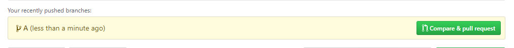
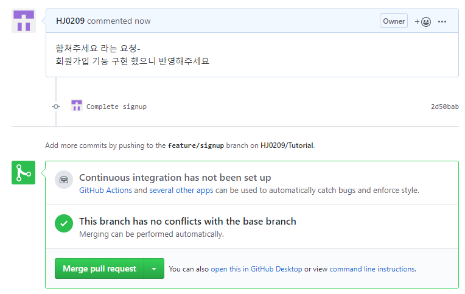

# Branch

* 독립적인 이력을 쌓아나갈 수 있는 환경을 형성하기 위해 브랜치 활용한다.
* 브랜치에서 작성한 코드를 사수가 확인하고 병합하거나 거절할 수 있다.
* 기능별 개발 브랜치 / 개발 완료 이후 배포 전 minor bug fix 등 반영
* [github-flow](https://bit.do/github-flow) / [TIL](https://github.com/edutak/TIL)


1. 브랜치 생성

   ```bash
   $ git branch #브랜치이름
   ```

2. 브랜치 목록

    ```bash
   $ git branch (브랜치 형성되었는지 확인)
    #브랜치이름
    * master
    ```

3. 브랜치 이동

   ```bash
   $ git checkout #브랜치이름 (브랜치 제대로 되었는지 체크)
   Switched to branch '#브랜치이름'
   ```

   생성 및 이동 

   ```bash
   $ git checkout -b #브랜치이름
   ```

   삭제

   ```bash
   $ git branch -d #브랜치이름
   ```

4. ```bash
   $ touch signup.txt
   ```

5. ```bash
   $ git add .
   ```

6. ```bash
   $ git commit -m '커밋제목'
   
   $ git commit -m 'Complete signup'
   [feature/signup 2d50bab] Complete signup
    1 file changed, 0 insertions(+), 0 deletions(-)
    create mode 100644 signup.txt
   ```

7. 

```bash
$ git push origin feature/signup
Enumerating objects: 4, done.
Counting objects: 100% (4/4), done.
Delta compression using up to 8 threads
Compressing objects: 100% (2/2), done.
Writing objects: 100% (3/3), 297 bytes | 297.00 KiB/s, done.
Total 3 (delta 0), reused 0 (delta 0)
remote:
remote: Create a pull request for 'feature/signup' on GitHub by visiting:
#GitHub에 방문해서 직접 확인해봐!

remote:      https://github.com/HJ0209/Tutorial/pull/new/feature/signup
remote:
To https://github.com/HJ0209/Tutorial.git
 * [new branch]      feature/signup -> feature/signup

```

8. 



9. `pull request`클릭해 승인 제출



마스터가 `merge pull request`누르면 병합된다.

10. ```bash
    $ git checkout master  (병합되었는지 확인)
    Switched to branch 'master'
    Your branch is behind 'origin/master' by 4 commits, and can be fast-forwarded.
      (use "git pull" to update your local branch)
    
    ```

11. ```bash
    $ git pull origin master
    ```


## 다른 사람의 Git Hub

* 권한이 없는 자료의 경우에는 `Fork`를 누르고 내 저장소로 가지고 온다.

  ```bash
  $ git clone GitHub_url
  ```


# Git Hub PAGES

* 블로그를 하고 싶은 사람의 경우 
  : Gatsby (react, graphql 등 기능 많음) - node 기반

  Jekyll (오래되어 자료 많음)  - ruby 기반 

  ​	-> 정적 템플릿 생성기 ; 마크다운 기반의 블로깅 가능 ; html / css / js


# 비밀파일 관리

* Git 저장소로 설정된 폴더의 모든 파일들은 변경사항이 추적된다.

만일 내가 git으로 관리하고 싶지 않은 파일이 있다면 `.gitignore` 파일을 생성해 비밀파일로 관리할 수 있다.

```bash
*.xlsx #특정확장자 파일
A.txt #특정 파일
images/ #특정 폴더
!upload.xlsx #이 파일만 업로드하고 나머지는 전부 git에 올리지 않는다.
```

* 직접 추가하는 내용 뿐만 아니라 일반적인 개발 환경에서 반드시 설정하는 파일/폴더들이 있다. 예) IDE 설정파일, cache 파일 등

* Gitignore.io 에서 변경사항을 추적할 필요가 없는 파일을 추적할 수 있도록 에시를 만들어 준다. (ex) Python, windows, node, react, visualstudiocode

