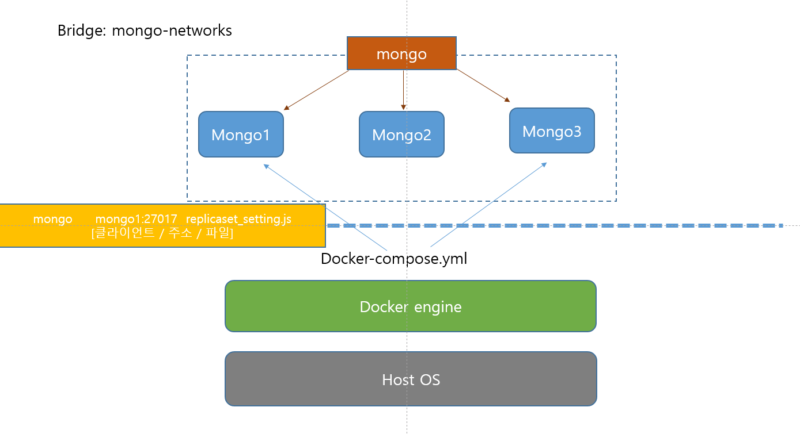
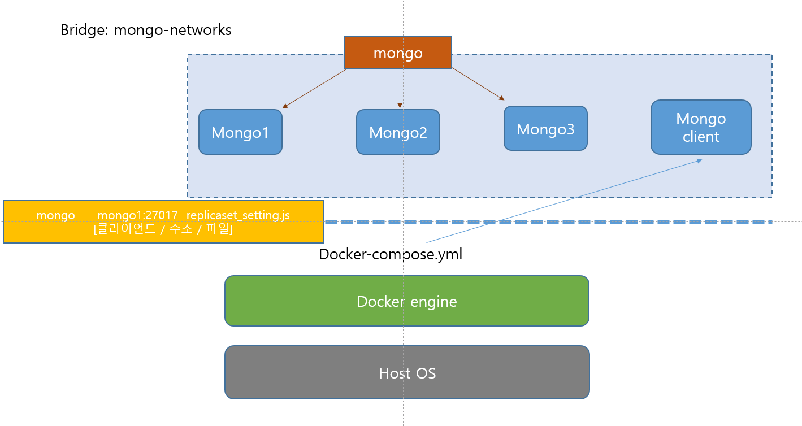

20.01.02

# 도커 공유폴더(볼륨)

1. 컨테이너를 삭제하면, 기존 컨테이너의 내용이 모두 사라진다. 업데이트를 위해서는 기존의 정보를 유지하는 것이 필요하기 때문에 외부의 저장소(볼륨)에 저장이 필요하다.

2. 컨테이너 유지 정보 : 아마존의 AWS S3 / 데이터 볼륨 이용

3. mysql 이용

   ```sql
   docker run -d -p 3306:3306 \ #기존에 사용하지 않는 포트 사용 필요 #run은 create+start
   -e MYSQL_ALLOW_EMPTY_PASSWORD=true \ #관리자로 접속할 때 비밀번호 불요
   --name mysql \ #도커컨테이너 이름 지정(원래 자동으로 부여) > 컨테이너 지칭할 대 아이디와 이름 모두 이용 가능
   -v /my/datadir:/var/lib/mysql #v는 볼륨의 약자 #':'앞은 호스트pc의 디렉토리이고 뒤는 게스트pc의 디렉토리이다 (원래 볼륨 설정안하면 /var/lib/mysql에 저장)
   mysql:5.7 #컨테이너의 이미지 (mysql의 5.7에 해당하는 이미지 다운)
   ```

   

# Lab-MongoDB 설치

## 몽고DB이용의 장점

* 하나의 컴퓨터가 아닌 여러 개로 나누어 포트 여러개 설정 가능


## 몽고DB 설정방법

1. 이미지 받아오기

   ```sql
   docker pull mongo 또는 docker pull mongo:4.1
   # 뒤에 버전을 쓰지 않으면 가장 최신 버전 다운
   ```

   ```sql
   C:\Users\HPE\Work\docker\day03>docker images
   REPOSITORY           TAG                 IMAGE ID            CREATED             SIZE
   mongo                latest              a0e2e64ac939        13 days ago         364MB
   # 이미지로 다운되었는지 확인 필요
   ```

2. 기동

   ```sql
   docker run --name mongodb_server -v /home/test/mongodb/db:/data/db \
   -d -p 16010:27017 mongo -auth
   # name :이름을 'mongo_server'로 설정
   # v: 볼륨 설정 (home이하 디렉토리를 data로 연결)
   # d : 백그라운드 실행
   # p : 27017포트가 필요하지만, 16010으로 연결(16010으로 연결하면 27017 응답)
   # 서버 여러개 설정할 때에 앞에 host는 번호 바뀌어야 한다
   # mongo :
   # auth : 관리자 계정으로 로그인
   # 처음 몽고db설치할 때에는 볼륨(v이하) 연결하지 않고, auth도 설정하지 않아도 됨
   
   docker run -d --name mongod-test -p 17017:27010 \
   -v /home/sa/data/mongod.conf:/etc/mongod.conf \
   -v /home/sa/data/db:/data/db mongo --config /etc/mongod.conf
   # 볼륨을 두개 연결 (host pc에서 작업한 내용을 연결된 컨테이너에 바로 내용 연결)
   # 기본적으로 mongod.conf로 기동하기 위해서는 congfig 옵션 활동
   ```

   ```sql
   C:\Users\HPE\Work\docker\day03>docker ps
   CONTAINER ID        IMAGE               COMMAND                  CREATED             STATUS              PORTS                      NAMES
   dc6a51eb9a65        mongo               "docker-entrypoint.s…"   10 minutes ago      Up 10 minutes       0.0.0.0:16010->27017/tcp   mongodb_server
   
   # docker ps로 실행되고 있는지 확인 필요! (status "up")
   ```

   

3. Bash 접근, 몽고 접속

   ```sql
   docker exec -it mongod_server bash (bash 대신 mongo도 가능)
   root@xxxxxx $ mongo
   # 현재 실행된 도커에 명령어 전달
   # mongod_server은 앞에서 name 통해 이름 지정한 것 (컨테이너 아이디도 가능)
   ```

4. 관리자 계정 생성

   ```sql
   mongo> use admin
   ```

5. 관리자 로그인, 일반 계정 생성

   ```sql
   mongo> db.createUser({
                        user: "admin", pwd:"admin", roles:[{role:"userAdminAnyDatabase",db:"admin"}]
                        })
   ```

6. ReplicaSet 설정 #관리자 아니어도 자동으로 프라이머리로 승격해 검사

   ```sql
   mongo -u "admin" -p "admin" -authenticationDatabse "admin"
   mongo>user testdb.createUser({user:"tester",pwd:"1234",roles:["dbAdmin","readWrite"]})
   ```

   

## 2개 이상 컨테이너 연결 방법

```sql
MongoDB 추가 2개로 docker container 생성
docker run mongodb_server_2 -d -p 26010:27017 mongo --replSet myapp
docker run mongodb_server_3 -d -p 36010:27017 mongo --replSet myapp
# : 뒤의 주소는 동일하더라도 앞의 주소는 달라야 한다

docker ps로 접속되었는지 확인

docker exec -it mongodb_server_2 bash
컨테이너 별로 별도의 창에서 작업 시작
```

```sql
mongodb_server_2에서
	rs.initiate()
	rs.add("mongodb_server_2:27017"), rs.add("mongodb_server_3:27017")
	db.isMaster() > 하나만 primary로 등록되었는지 확인
	rs.conf() #내용확인
	데이터베이스 생성, 데이터 추가 확인
```

* 앞서 rs.add("이름:주소")가 안되는 경우에는 다른 컨테이너 ip직접 확인해서 연결

```sql
docker ps
CONTAINER ID        IMAGE                       COMMAND                  CREATED             STATUS                      PORTS                      NAMES
 71c1bd8ed99d        mongo               "docker-entrypoint.s…"   2 minutes ago       Up 2 minutes        0.0.0.0:36010->27017/tcp   mongodb_server_3
```

docker ps에서 ip주소 확인할 컨테이너 ID확인 > 위의 경우 '71c1'

```sql
docker inspect 71c1 #조사하다
...
"Networks": {
                "bridge": {
                    "IPAMConfig": null,
                    "Links": null,
                    "Aliases": null,
                    "NetworkID": "2199765f959b65dce16e421fbcbde77ed927d66e7ef53bff82306b298bc35178",
                    "EndpointID": "37817ee2056982e99846d3d24df13c43113f0b305e0115600b000739f21ee197",
                    "Gateway": "172.17.0.1",
                    "IPAddress": "172.17.0.6",
                    "IPPrefixLen": 16,
                    "IPv6Gateway": "",
                    "GlobalIPv6Address": "",
                    "GlobalIPv6PrefixLen": 0,
                    "MacAddress": "02:42:ac:11:00:06",
                    "DriverOpts": null
                }
```

나온 결과 값 중 뒤쪽에 "IPAddress": "172.17.0.6"라고 나타남

* 이후 연결할 값에서 mongo들어간다

```sql
PS C:\Users\HPE\work\docker\day03> docker exec -it mongodb_server_1 bash
root@480c9f22f1d1:/# mongo
> rs.initiate()
myapp:SECONDARY> rs.add("ip_address:271017")
myapp:PRIMARY> db.isMaster #host 하나이고, ismaster 'true'
myapp:PRIMARY> rs.add("172.17.0.5:27017") #mongodb_server_2
myapp:PRIMARY> rs.add("172.17.0.6:27017") #mongodb_server_3
```

* IP가 연결되면 primary의 내용을 secondary가 계속 가지고 옴

  ```sql
  myapp:PRIMARY> db.isMaster() #host3개이고 ismaster 'true'임을 확인
  {
          "hosts" : [
                  "480c9f22f1d1:27017", #ID가 아니라 ipaddress로 변경 필요
                  "172.17.0.5:27017",
                  "172.17.0.6:27017"
          ],
          "setName" : "myapp",
          "setVersion" : 3,
  ```

  * ID를 IP address로 변경하기 위해 정보 확인 

    members에서 첫번째 host가 주소가 아닌 아이디로 구성됨을 확인

     "host" : "480c9f22f1d1:27017"(변경할 것) 

    / "host" : "172.17.0.5:27017"(변경 안해도 되는 것)

  ```sql
  myapp:PRIMARY> cfg = rs.conf();
  # 컨테이너의 내용들 확인
  # cfg._id하면 아이디인 "myapp"나타남
  # cfg._id="A"로 하면 A로 이름 바꾸겠다는 것
  
  {
          "_id" : "myapp",
          "version" : 3,
          "protocolVersion" : NumberLong(1),
          "writeConcernMajorityJournalDefault" : true,
          "members" : [...]
          "settings" : [...] 
          }
  ```

  ```sql
  myapp:PRIMARY> cfg.members[0].host = "172.17.0.3:27017"
  172.17.0.3:27017
  
  myapp:PRIMARY> rs.reconfig(cfg) #cfg 함수를 인식시킴
  {
          "ok" : 1,
          "$clusterTime" : {
                  "clusterTime" : Timestamp(1577933783, 1),
                  "signature" : {
                          "hash" : BinData(0,"AAAAAAAAAAAAAAAAAAAAAAAAAAA="),
                          "keyId" : NumberLong(0)
                  }
          },
          "operationTime" : Timestamp(1577933783, 1)
  }
  ```

  

# Docker 네트워크

```sql
docker network ls
```

* Brige network

* ```sql
  docker network create --driver brige [브릿지 이름]
  ```

  ```sql
  docker run 또는 docker create 에서 --net 옵션으로 커스텀 브릿지 사용
  ```

* Host network

  ```sql
  docker run -it --name network_host net 
  ```

  네트워크를 호스트로 설정하면 호스트의 네트워크환경을 그대로 사용

  포트 포워딩 없이 내부 어플리케이션 사용

* None network

  네트워크를 사용하지 않음 / lo 네트워크만 사용, 외부와 단절

* Container network

  다른 컨테이너의 네트워므 환경 공유

  --net container:[다른 컨테이너의 ID 또는 NAME]

  두 컨테이너 사이의 네트워크 정보가 동일

* Overlay network

  다른 호스트들 간에 네트워크 공유

# DOCKER-compose 통해 설치

* 도커 애플리케이션을 정의하고 실행하는 도구 (도커파일과 달리 여러개의 컨테이너를 통합해 관리)
* 도커파일 > 이미지빌드+옵션 > 도커컨테이너

* p.76

  * docker-compose 명령어 사용해 순서 등 관리

  ```sql
  docker container run -d -p 9000:8000 example/echo:latest
  ```

  * ```sql
    version: "3"
    services :
        echo : #들여쓰기는 services 안에 echo가 있는 것
           image: busybox:latest
           ports:
            	- 9000:8080 #대시 통해 여러개 병렬 가능
            	- 3306:3306
    ```

  * ```sql
    docker pull busybox:latest
    
    docker-compose up
    ```

* mongo-networks : IP 주소 없이도 몽고네트워크 연결해(mongo1, mongo2 등) 파일 교환 가능 > 레프리카 세팅 작업
  * 들여쓰기 주의하기!!!!!!  (함수별로 들여쓰기 간격 동일해야)
  * 연결하고는 `docker logs 컨테이너ID`로 확인

```sql
version: "3"
services:
    mongo1:
        image: "mongo"
        ports:
            - "16010:27017" #이거 하기 전에 16010 사용하는 mongodb_server_1 정지시키고 시작
        volumes:
            - $HOME/mongoRepl/mongo1:/data/db
        networks:
            - mongo-networks
        command:
            - mongod --replSet myapp #해당하는 명령어 바로 실행
        environment: #optioncal
    mongo2:
     depends_on:
            - mongo1
    mongo3: 
    
networks: #서비스에서 옵션 작업한 것 내용 정리 (network, volumes 등  )
    mongo-networks:
        driver: bridge
        
        
```

* replication setting #1

  docker exec -it [컨테이너이름] [커멘드]

  ```sql
  docker exec -it mongo_mongo1_1 mongo
  #exec : 이미 실행된 컨테이너에 추가 명령어 입력
  #it : 터미널 통해 입력
  ```

  몽고에 접속해 아래를 mongo1부터 mongo3까지 실행하려는 java script 저장(.js)

  > 자바스크립트 내용이 서버에 전달되어 실행됨(추가작업 실행)

  ```sql
  mongo > rs.initiate();
  mongo > rs.add("ip_address:port"); 처럼 입력
  
  mongo > rs.initiate();
  mongo > rs.add("172.17.0.3:27017"); #172.17.0.3 대신 mongo1로 대입 가능
  mongo > rs.add("172.17.0.5:27017");
  mongo > rs.add("172.17.0.6:27017");
  
  ```

  bash를 실행해 js를 실행하도록 입력

  ```sql
  docker exec -it mongo_mongo1_1 bash
  root@46b8352f6c67:/# mongo 172.17.0.3:27017 replcaset_setting.js
  ```

  network 목록을 보면 mongo_mongo-networks 존재

  ```sql
  C:\Users\HPE> docker network ls
  NETWORK ID          NAME                   DRIVER              SCOPE
  2199765f959b        bridge                 bridge              local
  d0d4517a9808        host                   host                local
  08aca9466121        mongo_mongo-networks   bridge              local
  41f9b8c2d112        none                   null                local
  ```

  ```sql
  docker network inspect [NETWORK ID]로 컨테이너 참여자 확인 가능
  여기에서 확인한 IPV4Address주소를 확인해 rs.add안의 주소 동일한지 확인해 수정
  ```

* replication setting 방법 #2

```js
config = {
    _id: "myapp",
    members: [
        {_id:0, host: "mongo1:27017"},
        {_id:1, host: "mongo2:27017"},
        {_id:2, host: "mongo3:27017"},
    ]
};
rs.initiate(config);
rs.config();
```

* 

* ```sql
  PS C:\Users\HPE> docker exec -it mongo_mongo1_1 bash
  root@46b8352f6c67:/# ls
  bin   data  docker-entrypoint-initdb.d  home        lib    media  opt   root  sbin  sys  usr
  boot  dev   etc                         js-yaml.js  lib64  mnt    proc  run   srv   tmp  var
  root@46b8352f6c67:/# touch test.js
  root@46b8352f6c67:/# echo "echo hello" >> test.js
  root@46b8352f6c67:/# ls
  bin   data  docker-entrypoint-initdb.d  home        lib    media  opt   root  sbin  sys      tmp  var
  boot  dev   etc                         js-yaml.js  lib64  mnt    proc  run   srv   test.js  usr
  root@46b8352f6c67:/# mv test.js test.sh
  root@46b8352f6c67:/# chmod +x test.sh
  root@46b8352f6c67:/# ./test.sh
  hello
  ```

* 

```sql
FROM mongo:latest

WORKDIR /usr/src
RUN mkdir mongo_config
WORKDIR /usr/src/mongo_config

COPY replicaset_setting.js . # 마지막 . 빼먹지 않도록 주의!

CMD ["mongo", "mongodb://mongo1:27017", "./replicaset_setting.js"]
#CMD는 반드시 한 번만 사용해야!
#원래 일반적으로 mongodb:// 프로토콜이 자동적으로 포함됨(생략가능)
```




* 별도로 mongo1,2,3의 IP를 지정하지 않아도 자동적으로 이를 인식하도록 만들기 위해 mongo client를 하나의 서버 안에 묶는 작업이다.

## 

---

# 실습01

1. 이미지 빌드 

   ```sql
   docker build -t mongodb_setting:latest .
   ```

2. 컨테이너 생성 및 실행

   ```sql
   docker run mongodb_setting:latest
   ```

3. YML 작성

   ```sql
   version: "3"
   services:
       mongo1:
       mongo2:
       mongo3:
   
       mongosetup:
           image: "mongodb_setting" #mongo1,2,3과 다르게 새로 빌드한 이미지 이름으로 작성
           networks:
               - mongo-networks #들여쓰기 정확히 맞추도록 주의! 하나의 공백도 주의하기!
           depends_on:
               - mongo3
   networks:
       mongo-networks:
           driver: bridge
   ```

   4. ```sql
      docker-compose up 
      ```

      반면, docker-compose down #stop과 rm을 동시에 진행 (데이터베이스 날아감) \

      > ps -a로 확인하더라도 남은 내용 나타나지 않음
      >
      > 데이터 보관을 위해서는 volumes 통해서 외부 볼륨에 저장 필요

   5. ```sql
      docker exec -it mongo_mongo3_1 mongo
      ```

      

---

# 실습02 (mySQL)-과제

Dockerfile

docker build -t test_mysql:latest .


docker-compose.yml

version;

services:

my_mysql:

image: test_mysql


> mysql 가져다가 환경변수를 이용해 새롭게 배포하는 것이 목적

---

--no-cache : 캐시 모두 삭제

---


# SWARM

```sql
S C:\Users\HPE\work\docker\day03\swarm> docker exec -it manager docker swarm init
Swarm initialized: current node (5m3dc9lqn5f9xgljekr5kao9r) is now a manager.

To add a worker to this swarm, run the following command:

    docker swarm join --token SWMTKN-1-3etbxighi8v80w4sxrbtuiv5c6dn6364o8emprnao4bptucnqx-60pt7cxy411q2xlx6oz1pforr 172.21.0.3:2377

To add a manager to this swarm, run 'docker swarm join-token manager' and follow the instructions.
```

또는

```sql
PS C:\Users\HPE\work\docker\day03\swarm> docker exec -it manager sh

/ # docker swam init
docker: 'swam' is not a docker command.
See 'docker --help'
/ # docker swarm init
Swarm initialized: current node (tu48f4fgw3hq4aq64pgx8b3ja) is now a manager.

To add a worker to this swarm, run the following command:

    docker swarm join --token SWMTKN-1-4y36c3epd9gvag6wrcc9uxyfcsl2cd02y0ob4acrlf0uzeff7c-dxw05sxj1n9q47f7dcb7yevkq 172.20.0.3:2377

To add a manager to this swarm, run 'docker swarm join-token manager' and follow the instructions.

/ # exit
```

이를 매니저, worker1,2,3에 반복 시행한다.

``` sql
PS C:\Users\HPE\work\docker\day03\swarm>  docker exec -it worker01 docker swarm join --token SWMTKN-1-3etbxighi8v80w4sxrbtuiv5c6dn6364o8emprnao4bptucnqx-60pt7cxy411q2xlx6oz1pforr 172.21.0.3:2377
This node joined a swarm as a worker.

PS C:\Users\HPE\work\docker\day03\swarm>  docker exec -it worker02 docker swarm join --token SWMTKN-1-3etbxighi8v80w4sxrbtuiv5c6dn6364o8emprnao4bptucnqx-60pt7cxy411q2xlx6oz1pforr 172.21.0.3:2377
This node joined a swarm as a worker.

PS C:\Users\HPE\work\docker\day03\swarm>  docker exec -it worker03 docker swarm join --token SWMTKN-1-3etbxighi8v80w4sxrbtuiv5c6dn6364o8emprnao4bptucnqx-60pt7cxy411q2xlx6oz1pforr 172.21.0.3:2377
This node joined a swarm as a worker.

PS C:\Users\HPE\work\docker\day03\swarm> docker exec -it manager docker node ls
ID                            HOSTNAME            STATUS              AVAILABILITY        MANAGER STATUS      ENGINE VERSION
5m3dc9lqn5f9xgljekr5kao9r *   2ebf1c90c423        Ready               Active              Leader              19.03.5
rboeqajhqra9y6uwwz9mr3d2t     a11ee886881b        Ready               Active                                  19.03.5
pi7t3mmf8q810hopte6qui7va     d1c50aa0c0dc        Ready               Active                                  19.03.5
l51xn5r75o7coqd8sgiml45kb     f1cf13e40cd1        Ready               Active                                  19.03.5
#매니저만 leader로 묶여 있음
# Swarm을 실행하면 leader이 임의적으로 slave 설정해 pc 할당해줌
```

* worker이 leave되어 잘안되는 경우에는 docker-compose down 하고 docker-compose up하기