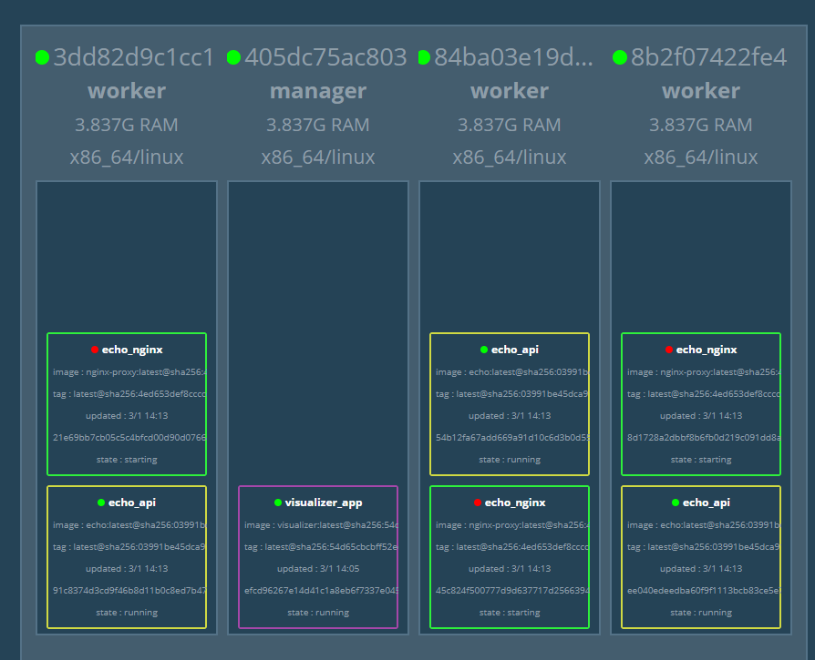
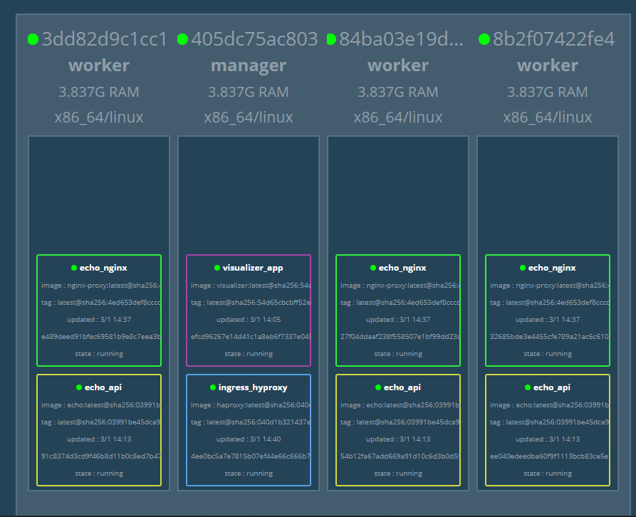
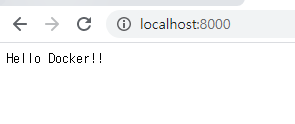
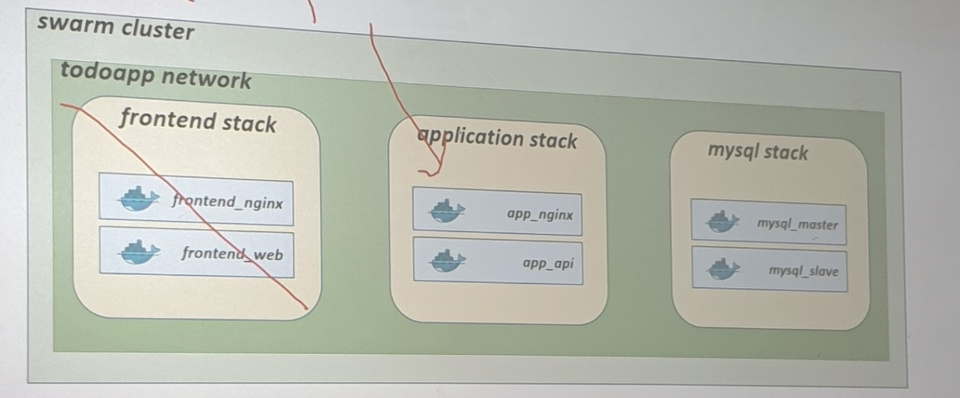
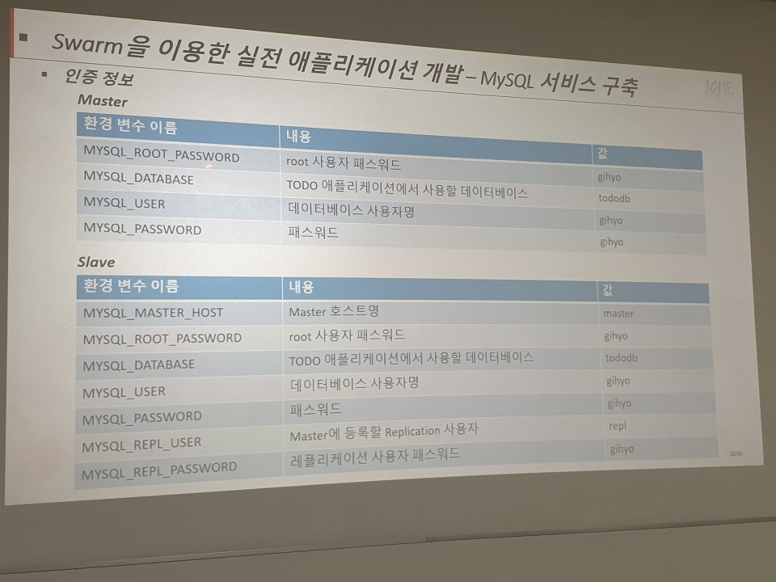
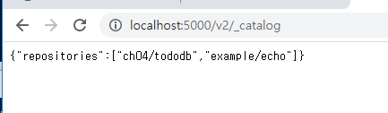

# DOCKER 03

## Docker Playground

1. labs.play-with-docker.com

2. node 생성

   ```sql
   docker swarm init --advertise-addr eth0
   docker info # swarm init 했으므로 swarm active됨
   docker node ls
   ```

3. node 연결

   docker info에서 나타난 아래를 node2에서 붙여넣기

   ```sql
       docker swarm join --token SWMTKN-1-2x8nnt8nm54vg6m46lr40vg6hk6u4h91wcy979kx8qe70t589r-dqvsxvdx6w97t3idcysi8ualr 192.168.0.13:2377
   ```

---

## Swarm 코드

- TCP port 2377 : cluster management 통신에 사용

- TCP/UDP port 7946 :  node 간의 통신에 사용
- TCP/UDP port 4789 : overlay network 트래픽에 사용


---

## SWARM 레지스트리 등록

1. 도커파일의 제작 (이름 : Dockerfile > 앞에 대문자 주의)   & 이미지인 golang도 가져오기

```sql
From golang:1.10

Run mkdir /echo
COPY main.go /echo

CMD ["go", "run", "/echo/main.go"]

```

2. 도커파일 실행

   ```sql
   docker run example/echo:latest -p 8080:8080
   ```

3. 인터넷에 `localhost:8080` 검색하면 내용인 "Hello Docker!!" 나타남

---

4. 이미지 이름 변경

   ```sql
   docker image tag exmaple/echo:latest localhost:5000/example/echo:latest
   #이미지의 태그 이름 변경 : 앞의 원래 이름인 example/echo를 localhost:5000/example/echo로 복사해 태그 변경 (로컬호스트에 올릴 수 있음)
   ```

   > docker images 에 `example/echo`와 `localhost:5000/example/host` 모두 존재

5. 이미지 올리기

   ```sql
   PS C:\Users\HPE\work\docker\day04> docker push localhost:5000/example/echo:latest
   ```

   > 인터넷에서 `localhost:5000/v2/_catalog`검색하면 `example/echo`레지스토리 확인 가능

6. 워커에 이미지 다운받기

   ```sql
   docker exec -it worker01 sh
   
   #docker pull registry:5000/example/echo:latest
   ```

   또는

   ```sql
   docker exec -it worker01 docker pull registry:5000/example/echo:latest
   ```

   > docker  exec -it manager sh
   >
   > #hostname 에서 나온 '2eb~'는
   >
   > docker ps 에서 manager의 아이디인 '2eb~' 와 동일하다

   docker swarm join --token SWMTKN-1-0dmkzdivrgq3g4vuew4ejyqkb4rv6x2yk3hob6331a77ka6bj2-98dg4bes21dfakwlymym1ehvt 172.21.0.3:2377

   > 마우스 오른쪽 버튼만 눌러도 복사붙여넣기 가능!


---

## Docker Service

> 서비스 : 애플리케이션을 구성하는 일부 컨테이너를 제어하기 위한 단위

```sql
docker exec -it manager \
docker service create --replicas 1 --publish 8000:8080 --name echo\
registry:5000/example/echo:latest
# replicas : 복제 목적어로 뒤에 붙는 숫자가 몇개의 컨테이너를 만들 것인지

docker exec -it manager docker service ls
docker exec -it manager docker service scale [서비스이름]=[숫자]
# 앞의 replicas 복제 작업을 [숫자]개로 늘리겠다는 것
docker exec -it manager docker serviec ps echo
#ps는 프로세스 확인으로 echo라는 프로세스를 확인하는 것
docker exec -it manager docker service rm echo
```

---

1. 서비스는 swarm이 설정되어야 확인 가능하므로, 매니저로 이동 필요

```sql
docker exec -it manager sh
```

2. 서비스 제작

```sql
# docker service create --replicas 1 --publish 8000:8080 --name echo registry:5000/example/echo:latest
> 만들고 # docker serviec ls로 잘 제작되었는지 확인
```

3. 서비스 복제

   ```sql
   # docker service scale echo=6
   echo라는 이름의 서비스를 6개로 늘리겠다는 것
   > # docker service ls 에서 replicas가 1/1에서 6/6으로 변한 것 확인
   > # docker service ps echo로 echo라는 이름의 서비스 6개가 실행되고 있음
   ```


## Docker Stack

> Stack : 하나 이상의 서비스를 그룹으로 묶는 단위. 어플리케이션 전체 구성을 정의해 여러 서비스를함께 다룰 수 있다. Overlay 네트워크 > 다른 호스트 사이에 정보를 주고 받는 것
>
> 반면 서비스는 어플리케이션 이미지를 하나 밖에 다루지 못한다.

1. 네트워크 생성

   ```sql
   docker exec -it manager sh
   # docker network create --driver=overlay --attachable ch03
   > #docker network ls 통해 ch03 네트워크 생성되었는지 확인
   ```

2. yml 파일 작성

   ```yml
   version: "3"
   services:
       nginx:
           image: gihyodocker/nginx-proxy
           deploy: #스택에 배포
               replicas: #복제개수
               placement: #설치위치
               	constraints: [node.role !=manager] #manager가 아닌 애들만 설치하겠다. '!='는 뒤가 아닌 애들을 의미
           environment: #환경변수
           	BACKEND_HOST: echo_api:8080 #echo 아래있는 api를 넘겨주는 것
           depends_on:
           	- api
           networks:
           	- ch03
       api:
           image: registry:5000/example/echo:latest
           deploy:
               replicas: 3
               placement: [node.role !=manager]
           networks:
           	- ch03
   
   networks:
       ch03:
           external: true
   ```

3. yml 파일 연결

   ```sql
   docker exec -it manager sh
   # ls -al /stack (앞서 stack 파일에 stack을 볼륨으로 지정해 파일 docker-compose.yml생성했음)
   # docker stack deploy -c /stack/ch03-webapi.yml echo
   (c가 파일 저장애찯ㄱ 위치 / echo는 파일 이름) > 배포
   ```


## DOCKER VISUALIZER

```sql
1. docker-compose up

2 매니저 swarm 확인
C:\Users\HPE\work\docker\day03\swarm> docker exec -it manager sh

/ # docker swarm init
Swarm initialized: current node (yuffhpiw7itik7pvlocjzt75n) is now a manager.

To add a worker to this swarm, run the following command:

    docker swarm join --token SWMTKN-1-1xornxbr38w5k22mo96fnojtrg2v2hdso1feg6dgifvp18u5m9-1i10m5lab9wpdmieh265xngfl 172.23.0.3:2377

To add a manager to this swarm, run 'docker swarm join-token manager' and follow the instructions.

/ # exit

3. 워커들 join하기
C:\Users\HPE\work\docker\day03\swarm> docker exec -it worker01    docker swarm join --token SWMTKN-1-1xornxbr38w5k22mo96fnojtrg2v2hdso1feg6dgifvp18u5m9-1i10m5lab9wpdmieh265xngfl 172.23.0.3:2377
This node joined a swarm as a worker.

PS C:\Users\HPE\work\docker\day03\swarm>
>> docker exec -it worker02     docker swarm join --token SWMTKN-1-1xornxbr38w5k22mo96fnojtrg2v2hdso1feg6dgifvp18u5m9-1i10m5lab9wpdmieh265xngfl 172.23.0.3:2377
This node joined a swarm as a worker.

PS C:\Users\HPE\work\docker\day03\swarm> docker exec -it worker03     docker swarm join --token SWMTKN-1-1xornxbr38w5k22mo96fnojtrg2v2hdso1feg6dgifvp18u5m9-1i10m5lab9wpdmieh265xngfl 172.23.0.3:2377
This node joined a swarm as a worker.

도커 visualize 연결하기
PS C:\Users\HPE\work\docker\day03\swarm> docker exec -it manager docker stack deploy -c /stack/visualizer.yml visualizer
Creating network visualizer_default
Creating service visualizer_app
```

```sql
docker exec -it manager sh

/ # docker network create --driver=overlay --attachable ch03
lq36feg4rb38wmbf2wnj19z61

/ # docker stack deploy -c /stack/ch03-webapi.yml echo
Creating service echo_nginx
Creating service echo_api
```




* 현재 상황

  ```sql
  S C:\Users\HPE\work\docker\day03\swarm\stack> docker exec -it manager docker stack ls
  NAME                SERVICES            ORCHESTRATOR
  echo                2                   Swarm
  visualizer          1                   Swarm
  
  PS C:\Users\HPE\work\docker\day03\swarm\stack> docker exec -it manager docker service ls
  ID                  NAME                MODE                REPLICAS            IMAGE                               PORTS
  ibkol5u4cn82        echo_api            replicated          3/3                 registry:5000/example/echo:latest
  j4eaw7yqs2st        echo_nginx          replicated          3/3                 gihyodocker/nginx-proxy:latest
  knq44i9vl6o4        visualizer_app      global              1/1                 dockersamples/visualizer:latest     *:9000->8080/tcp
  ```

* manager의 포트 : 9000>9000 / visualize의 포트 : 9000>8080

  따라서, 9000번으로 들어오면 9000>9000>8080으로 최종적으로 8080 응답

---


## Docker HAProxy

> HAProxy : 대행자 / 외부 호스트에서 요청되는 트래픽을 목적 서비스로 보내주는 프록시 서버 설정(회사의 보안 목적) . dockercloud/haproxy이미지로 배포. 가용성
>
> 사내 내부에서 외부의 사이트로 연결하거나 컨테이너 외부에서 서비스에 접근할 수 있도록 해주는 다리 역할(ingress). 서비스가 배치된 노드에 로드 밸런싱 기능 제공
>
> 반면, Visualizer는 외부호스트에서 접속가능 (Host>Manager 사이는 port forwarding설정)


1. ch03-ingress.yml 작성

   ```sql
   version: "3"
   
   services:
       hyproxy:
           image: dockercloud/haproxy
           networks:
               - ch03
           volumes:
               - /var/run/docker.sock:/var/run/docker.sock
           deploy:
               mode: global
               placement:
                   constraints:
                       - node.role == manager
           ports:
               - 80:80
               - 1936:1936 # for stats page (basic auth. stats:stats)
       
   networks:
       ch03:
           external: true
   
   ```

2. 기존의 ch03-webapi.yml의 environment에서 `SERVICE_PORTS:80` 추가

   ```sql
   version: "3"
   services:
       nginx:
           image: gihyodocker/nginx-proxy
           deploy: 
               replicas: 3
               placement:
                   constraints: [node.role !=manager]
           environment:
                   SERVICE_PORTS: 80
                   BACKEND_HOST: echo_api:8080
           depends_on:
               - api
           networks:
               - ch03
               
       api:
           image: registry:5000/example/echo:latest
           deploy:
               replicas: 3
               placement: 
                   constraints: [node.role !=manager]
           networks:
               - ch03
   
   networks:
       ch03:
           external: true
   ```

3. 배포 (하나는 echo. 하나는 ingress)

   ```sql
   PS C:\Users\HPE\work\docker\day03\swarm\stack> docker container exec -it manager sh
   
   / # docker stack deploy -c /stack/ch03-ingress.yml ingress
   Creating service ingress_hyproxy
   새로 만든 프록시는 create 됨 
   
   / # docker stack deploy -c /stack/ch03-webapi.yml echo
   Updating service echo_api (id: ibkol5u4cn825nmz8jsuxmtuj)
   Updating service echo_nginx (id: j4eaw7yqs2stu4ge52vrnscei)
   기존의 api와 nginx는 이미 존재하였기 때문에 update됨
   ```

4. 확인

   ```sql
   / # docker service ls
   ID                  NAME                MODE                REPLICAS            IMAGE                               PORTS
   ibkol5u4cn82        echo_api            replicated          3/3                 registry:5000/example/echo:latest
   j4eaw7yqs2st        echo_nginx          replicated          3/3                 gihyodocker/nginx-proxy:latest
   oa9upnzbc8en        ingress_hyproxy     global              1/1                 dockercloud/haproxy:latest          *:80->80/tcp, *:1936->1936/tcp
   knq44i9vl6o4        visualizer_app      global              1/1                 dockersamples/visualizer:latest     *:9000->8080/tcp
   ```

   ```sql
   PS C:\Users\HPE\work\docker\day03\swarm\stack> docker exec -it manager docker service ps ingress_hyproxy ls
   ID                  NAME                                        IMAGE                        NODE                DESIRED STATE       CURRENT STATE           ERROR               PORTS
   2himrzh47s5p        ingress_hyproxy.yuffhpiw7itik7pvlocjzt75n   dockercloud/haproxy:latest   405dc75ac803        Running             Running 2 minutes ago      
   ```

   

   manager에 hyproxy 배정됨

* window>mangager>haproxy에 8000>80>80 순으로 접속

  윈도우에 `localhost:8000`접속하면 `Hello Docker!!`나타난다

  


## 스웜을 이용한 애플리케이션 개발

1. 배치 전략

데이터 스토어 역할을 할 mysql 서비스를 master-slave 구조로 구축

mysql과 데이터를 주고 받을 api 구현

nginx를 웹 애플리케이션과 api 사이에서 리버스 프록시 역할을 하도록 설정

api를 사용해 서버 사이드 랜더링을 수행할 웹 어플리케이션 구현

프론트앤드 쪽에 리버스 프록시(nginx) 배치




2. 현재 상황 (manager 1개 / worker 3개)

   ```sql
   PS C:\Users\HPE\work> docker ps
   CONTAINER ID        IMAGE                 COMMAND                  CREATED             STATUS              PORTS                                                                   NAMES
   84ba03e19d13        docker:19.03.5-dind   "dockerd-entrypoint.…"   2 hours ago         Up 2 hours          2375-2376/tcp, 4789/udp, 7946/tcp, 7946/udp                             worker03
   8b2f07422fe4        docker:19.03.5-dind   "dockerd-entrypoint.…"   2 hours ago         Up 2 hours          2375-2376/tcp, 4789/udp, 7946/tcp, 7946/udp                             worker02
   3dd82d9c1cc1        docker:19.03.5-dind   "dockerd-entrypoint.…"   2 hours ago         Up 2 hours          2375-2376/tcp, 4789/udp, 7946/tcp, 7946/udp                             worker01
   405dc75ac803        docker:19.03.5-dind   "dockerd-entrypoint.…"   2 hours ago         Up 2 hours          2375-2376/tcp, 3375/tcp, 0.0.0.0:9000->9000/tcp, 0.0.0.0:8000->80/tcp   manager
   6ad615d3b582        registry:latest       "/entrypoint.sh /etc…"   2 hours ago         Up 2 hours          0.0.0.0:5000->5000/tcp                                                  registry
   
   
   PS C:\Users\HPE\work> docker exec -it manager docker node ls
   ID                            HOSTNAME            STATUS              AVAILABILITY        MANAGER STATUS      ENGINE VERSION
   xyu54xjjerqlrweo1bj79nf03     3dd82d9c1cc1        Ready               Active                                  19.03.5
   l7guleehmrv376zi2ne6k45h9     8b2f07422fe4        Ready               Active                                  19.03.5
   s89lelz4rnqcxinjxmxqjh0cs     84ba03e19d13        Ready               Active                                  19.03.5
   yuffhpiw7itik7pvlocjzt75n *   405dc75ac803        Ready               Active              Leader              19.03.5
   ```

3. overlay네트워크 형성

   ```sql
   PS C:\Users\HPE\work> docker exec -it manager sh
   / # docker network create --driver=overlay --attachable todoapp
   ```

---

### Master/Slave 이미지 생성

1. Master/Slave 구조 구축

   - Master/Slave 서버 아이디가 각자 독립적으로 존재 필요 (replicaset할 것이기 때문에 서로 다른 번호 필요)
   - docker hub의 mysql:5.7 이미지로 생성
   - master과 slave 두 역할을 모두 수행할 수 있는 하나의 이미지로 생성
   - Mysql_master 환경 변수의 유무에 따라 master과 slave 결정
   - replicas 값을 설정해 slave 개수 조정

2. 인증정보

   

3. MYSQL 설정파일

   https://github.com/joneconsulting/cloud-computing.git 에서 pull해서 다운

   todo 폴더를 \swarm에 복사하고, \swarm\stack에도 복사해 두기

   * mysqld.cnf 파일을 열기 (p.135)

   ```cnf
   [mysqld]
   character-set-server = utf8mb4
   collation-server = utf8mb4_general_ci
   pid-file	= /var/run/mysqld/mysqld.pid
   socket		= /var/run/mysqld/mysqld.sock
   datadir		= /var/lib/mysql
   #log-error	= /var/log/mysql/error.log
   # By default we only accept connections from localhost
   #bind-address	= 127.0.0.1
   # Disabling symbolic-links is recommended to prevent assorted security risks
   # 주석으로 막아두어 접속 허용
   symbolic-links=0
   relay-log=mysqld-relay-bin 
   relay-log-index=mysqld-relay-bin 
   
   log-bin=/var/log/mysql/mysql-bin.log
   
   server-id=1
   # 서버 여러개 만들 것이기 때문에 ID설정 필요
   # 파일이 복사되더라도 마스터, 슬레이브 마다 아이디 계속 변경해야
   # 'Add-server-id.sh' 통해 서버아이디 자동으로 변경되도록 배포
   ```

   * `add-server-id.sh` 파일

     ```sh
     #!/bin/bash -e
     OCTETS=(`hostname -i | tr -s '.' ' '`)
     
     MYSQL_SERVER_ID=`expr ${OCTETS[2]} \* 256 + ${OCTETS[3]}`
     #서버ID는 unique하므로 이들 중 특정 값을 가지고 와서 설정
     echo "server-id=$MYSQL_SERVER_ID" >> /etc/mysql/mysql.conf.d/mysqld.cnf
     ```

4. Replication 설정 (p.142)

   ```sql
   #!/bin/bash -e
   
   # (1) 환경 변수로 마스터와 슬레이브를 지정
   if [ ! -z "$MYSQL_MASTER" ]; then
     echo "this container is master"
     return 0
   fi
   
   echo "prepare as slave"
   
   # (2) 슬레이브에서 마스터와 통신 가능 여부 확인
   if [ -z "$MYSQL_MASTER_HOST" ]; then
     echo "mysql_master_host is not specified" 1>&2
     return 1
   fi
   
   while :
   do
     if mysql -h $MYSQL_MASTER_HOST -u root -p$MYSQL_ROOT_PASSWORD -e "quit" > /dev/null 2>&1 ; then
       echo "MySQL master is ready!"
       break
     else
       echo "MySQL master is not ready"
     fi
     sleep 3
   done
   
   # (3) 마스터에 레플리케이션용 사용자 생성 및 권한 부여
   IP=`hostname -i`
   IFS='.'
   set -- $IP
   SOURCE_IP="$1.$2.%.%"
   mysql -h $MYSQL_MASTER_HOST -u root -p$MYSQL_ROOT_PASSWORD -e "CREATE USER IF NOT EXISTS '$MYSQL_REPL_USER'@'$SOURCE_IP' IDENTIFIED BY '$MYSQL_REPL_PASSWORD';"
   mysql -h $MYSQL_MASTER_HOST -u root -p$MYSQL_ROOT_PASSWORD -e "GRANT REPLICATION SLAVE ON *.* TO '$MYSQL_REPL_USER'@'$SOURCE_IP';"
   
   # (4) 마스터의 binlog 포지션 정보 확인
   MASTER_STATUS_FILE=/tmp/master-status
   mysql -h $MYSQL_MASTER_HOST -u root -p$MYSQL_ROOT_PASSWORD -e "SHOW MASTER STATUS\G" > $MASTER_STATUS_FILE
   BINLOG_FILE=`cat $MASTER_STATUS_FILE | grep File | xargs | cut -d' ' -f2`
   BINLOG_POSITION=`cat $MASTER_STATUS_FILE | grep Position | xargs | cut -d' ' -f2`
   echo "BINLOG_FILE=$BINLOG_FILE"
   echo "BINLOG_POSITION=$BINLOG_POSITION"
   
   # (5) 레플리케이션 시작
   mysql -u root -p$MYSQL_ROOT_PASSWORD -e "CHANGE MASTER TO MASTER_HOST='$MYSQL_MASTER_HOST', MASTER_USER='$MYSQL_REPL_USER', MASTER_PASSWORD='$MYSQL_REPL_PASSWORD', MASTER_LOG_FILE='$BINLOG_FILE', MASTER_LOG_POS=$BINLOG_POSITION;"
   mysql -u root -p$MYSQL_ROOT_PASSWORD -e "START SLAVE;"
   
   echo "slave started"
   
   ```

5. 이미지 빌드

   ```sql
   PS C:\Users\HPE\work> cd docker
   PS C:\Users\HPE\work\docker> cd day03
   PS C:\Users\HPE\work\docker\day03> cd swarm
   PS C:\Users\HPE\work\docker\day03\swarm> cd stack
   PS C:\Users\HPE\work\docker\day03\swarm\stack> cd tododb
   
   PS C:\Users\HPE\work\docker\day03\swarm\stack\tododb> dir
   
       디렉터리: C:\Users\HPE\work\docker\day03\swarm\stack\tododb
   
   Mode                LastWriteTime         Length Name
   ----                -------------         ------ ----
   d-----     2020-01-03   오후 4:20                etc
   d-----     2020-01-03   오후 4:20                sql
   -a----     2020-01-03   오후 4:18           6148 .DS_Store
   -a----     2020-01-03   오후 4:18            190 add-server-id.sh
   -a----     2020-01-03   오후 4:18            849 Dockerfile
   -a----     2020-01-03   오후 4:18            136 init-data.sh
   -a----     2020-01-03   오후 4:18           1805 prepare.sh
   
   #위의 디렉토리가 정확하게 나오는 폴더에서 이미지 빌드 실행 필요
   ```

   ```sql
   docker image build -t ch04/tododb:latest .
   # successfully 떴는지 결과로 확인
   ```

   ```sql
   docker images 통해 이미지 빌드 확인
   
   PS C:\Users\HPE\work\docker\day03\swarm\stack\tododb> docker images
   REPOSITORY                    TAG                 IMAGE ID            CREATED             SIZE
   ch04/tododb                   latest              8abc15bb4baa        2 minutes ago       479MB
   ```

   6. 이미지 태그 등록 및 업로드

   ```sql
    C:\Users\HPE\work\docker\day03\swarm\stack\tododb> docker tag ch04/tododb:latest localhost:5000/ch04/tododb:latest
    #localhost:5000의 web에 올리기 위해 로컬호스트로 태그 등록 필요
    
    C:\Users\HPE\work\docker\day03\swarm\stack\tododb> docker push localhost:5000/ch04/tododb:latest
   ```

   7. 결과

   

8. worker들에게 이미지 저장

   ```sql
   docker exec -it worker01 sh 를 반복
   
   # docker pull registry:5000/ch04/tododb:latest
   # docker image ls
   # docker run -d -p 3306:3306 registry:5000/ch04/tododb:latest
   # docker container ls
   ```

   ```sql
   docker container exec -it manager \
   docker stack deploy -c /stack/todo-mysql.yml todo_mysql
   # worker01,02에 별도로 작업해야 했던 것을 docker-compose 파일인 yml 하나로 수행
   
   docker container exec -it manager \
   docker service ls
   ```

---

### 네트워크 설정

1. todoapp 네트워크 설정되어 있는지 확인

```sql
 C:\Users\HPE\work\docker\day03\swarm\stack\tododb> docker exec -it manager sh
/ # docker network ls
NETWORK ID          NAME                 DRIVER              SCOPE
6pke93y7x4wv        todoapp              overlay             swarm
```

2. todo-mysql 확인 (마스터 1개. 슬레이브2개)

   ```sql
   version: "3"
   
   services:
     master:
       image: registry:5000/ch04/tododb:latest
       deploy:
         replicas: 1
         placement:
           constraints: [node.role != manager]
       environment:
         MYSQL_ROOT_PASSWORD: gihyo 
         MYSQL_DATABASE: tododb 
         MYSQL_USER: gihyo 
         MYSQL_PASSWORD: gihyo 
         MYSQL_MASTER: "true"
       networks:
         - todoapp
   
     slave:
       image: registry:5000/ch04/tododb:latest
       deploy:
         replicas: 2
         placement:
           constraints: [node.role != manager]
       depends_on:
         - master
       environment:
         MYSQL_MASTER_HOST: master
         MYSQL_ROOT_PASSWORD: gihyo 
         MYSQL_DATABASE: tododb 
         MYSQL_USER: gihyo 
         MYSQL_PASSWORD: gihyo 
         MYSQL_ROOT_PASSWORD: gihyo 
         MYSQL_REPL_USER: repl 
         MYSQL_REPL_PASSWORD: gihyo 
       networks:
         - todoapp
   
   networks:
     todoapp:
       external: true
   ```

3. 도커의 스택 확인해 `visualizer`만 남기기

   ```sql
   / # docker stack ls
   NAME                SERVICES            ORCHESTRATOR
   echo                2                   Swarm
   ingress             1                   Swarm
   visualizer          1                   Swarm
   / # docker stack rm echo
   Removing service echo_api
   Removing service echo_nginx
   / # docker stack rm ingress
   Removing service ingress_hyproxy
   
   / # docker stack ls
   NAME                SERVICES            ORCHESTRATOR
   visualizer          1                   Swarm
   ```

4. 스택서비스 등록

   ```sql
   / # docker stack deploy -c /stack/todo-mysql.yml todo_mysql
   Creating service todo_mysql_master
   Creating service todo_mysql_slave
   
   / # docker stack service ps tododb_mysql
   ```

* 권한 문제로 인한 경우에는 `add` 다 지우고, `LF`로 바꿔서 실행
* 확인하는 방법

```sql
docker exec -it worker01 sh
# docker ps
# docker exec -it [컨테이너ID] mysql -uroot -p  :mysql에 접속하는 커맨드 설정
```


