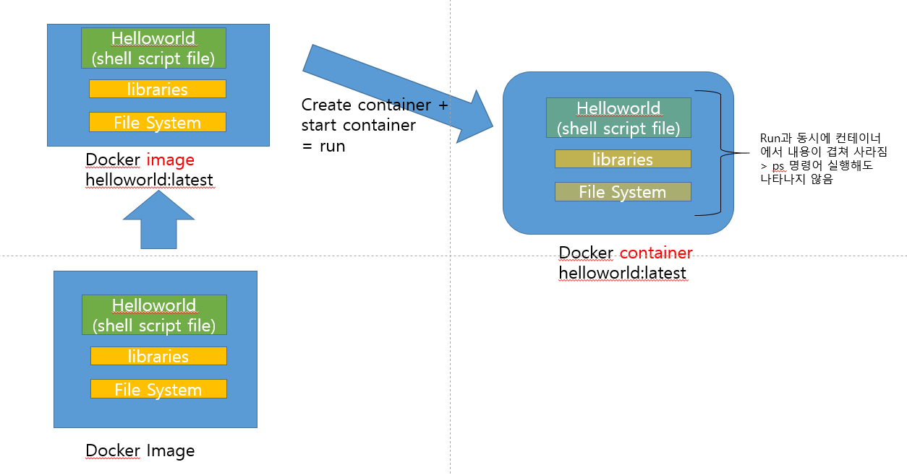
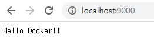
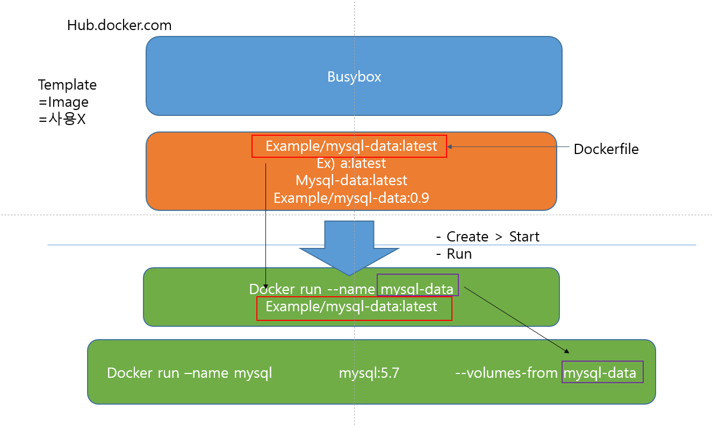

# Docker 01


## 도커의 특징(p.1)

1. 도커 : 가상화시스템. 윈도우의 물리적 하드웨어의 물리적 리소스(ram, cpu 등)를 쪼개어 나누어 윈도우가 아닌 새로운 OS를 이용할 수 있도록 지원하는 프로그램 
   컨테이너 기반의 가상화 기술 (7년도 되지 않은 기술)
   (작업관리자 > 성능 > CPU에서 가상화 활성화 되어있는지 확인)
   일반PC, AWS, Azure, Google cloud 등에서 실행가능 / 오픈소스
   **컨테이너형 가상화** : 가상화 소프트웨어 없이도 운영 체제의 리소스를 격리해 가상 운영 체제로 만드는 것 > 컨테이너를 쉽게 만들고, 사용하고, 버릴 수 있다.
2. 장점 : 경량 가상 환경(별도의 OS 등 필요없이 바로 다운 받아서 실행 가능), 이식성(개발 및 운영환경 동등하게 재현), 컨테이너 생성 속도 빠름(과거 15분 정도에서 공유한 내용을 제외해 1분 정도로 시간 감소)
   실행 환경째로 배포하는 방식으로 어플리케이션이 운영 체제의 영향을 받지 않는다.  

cf. nginx 같은 경우에는 웹서버이므로 OS인 리눅스가 필요하고, 리눅스와 nginx 모두 설치되어야 이를 기반으로 하는 어플리케이션을 실행할 수 있다.

3. 단점 : OS의 기능을 동일하게 실행하기 위해서는 도커 부적합
4. 호스트 운영체제형 가상화 vs 컨테이너형 가상화
5. Layer 저장방식 : 유니온 파일 시스템을 이용 ; 필요한 시스템이 있을때 처음부터 전부 설치하는 것이 아니라 기존에 설치되어 있는 OS 기반 위에 중복 제외하고 설치
6. 도커 이미지 : 컨테이너 실행에 필요한 파일과 설정 값 등을 포함 (상태값X) > 실체화되어 있는 것이 컨테이너 
   과거에 직접 사이트에 방문하여 Docker hub에서 이미지들 다운(pull)받음 > 쓸 수 있는 컨테이너 형태로 이용
   이미지를 가지고 있는 Hub가 마스터 / 이미지를 이용하는 측이 클라이언트




---


## 도커의 설치(p.19)

* [hub.docker.com](hub.docker.com) 에서 window로 데스트탑 버전 다운 및 설치
  * 윈도우10이 아니거나 기업용이 아닌 경우, 툴박스 설치 필요
* crul-fsSL https://get.docker.com | sudo sh (리눅스인 경우) 
  그러나 리눅스도 가상화되어 있어 리눅스 위에 도커를 올리는 경우에는, 가상화 위의 가상화로 리소스가 감소하므로 윈도우 위에 바로 설치하는 것을 추천

* reopositories > 나만의 저장소로 다른 사람과 공유가능


---

## 도커의 세팅 (p.21)

* Advanced : 도커에 할당되어 있는 CPU, 메모리, 이미지 사이즈 등 설정
  * 다른 것들은 그대로 두고, Memory만 4GB로 변경
* cmd 실행해서 확인

```sql
C:\Users\HPE>docker version

Client: Docker Engine - Community
 Version:           19.03.5
 API version:       1.40
 Go version:        go1.12.12
 Git commit:        633a0ea
 Built:             Wed Nov 13 07:22:37 2019
 OS/Arch:           windows/amd64
 Experimental:      false

Server: Docker Engine - Community
 Engine:
  Version:          19.03.5
  API version:      1.40 (minimum version 1.12)
  Go version:       go1.12.12
  Git commit:       633a0ea
  Built:            Wed Nov 13 07:29:19 2019
  OS/Arch:          linux/amd64
  Experimental:     false
 containerd:
  Version:          v1.2.10
  GitCommit:        b34a5c8af56e510852c35414db4c1f4fa6172339
 runc:
  Version:          1.0.0-rc8+dev
  GitCommit:        3e425f80a8c931f88e6d94a8c831b9d5aa481657
 docker-init:
  Version:          0.18.0
  GitCommit:        fec3683
```

> docker에서 client, server 두 가지 버전이 나와야 한다.


---

## DOCKER의 예제 01

* cmd에서 작성 시작

```sql
C:\Users\HPE>cd work

C:\Users\HPE\Work>dir
 C 드라이브의 볼륨에는 이름이 없습니다.
 볼륨 일련 번호: A0B4-FAD1

 C:\Users\HPE\Work 디렉터리

2019-12-30  오전 09:55    <DIR>          .
2019-12-30  오전 09:55    <DIR>          ..
2019-12-30  오전 09:55    <DIR>          mongodb-4.2.2
               0개 파일                   0 바이트
               3개 디렉터리  924,814,168,064 바이트 남음

C:\Users\HPE\Work>mkdir docker\day01

C:\Users\HPE\Work>cd docker\day01
```

* 이후 Visual Studio Code 실행

  * Extiension 에서 docker 검색해 보기 쉽게 설치

  * ```visual basic\
    #! /bin/sh
    
    echo "Hello,World!" #셀 스크립트 파일 제작
    ```

  * ```dockerfile
    * Docker File (도커 이미지 빌드)
    
    FROM ubuntu:16.04 
    #우분투 이미지(운영 체제)를 다운받아 와서
    #도커의 경우 운영 체제와 겹치는 부분을 사용하기 때문에 우분투 OS에서 필요한 내용을 다운받겠다는 것
    
    COPY helloworld /usr/local/bin  #앞서 작서한 셀 스크립트인 helloworld를 /usr/local/bin에 복사해
    RUN chmod +x /usr/local/bin/helloworld #명령 수행(helloworld 스크립트에 실행 권한 부여)
    
    CMD ["helloworld"] #helloworld 단어로 실행
    ```

* 다시 cmd와서

```sql
C:\Users\HPE\Work\docker\day01>docker image build -t helloworld:latest .
# build해서 최신 이미지로 만듬 & 태그
(latest는 가장 최근 이미지로 저장ㅎ가ㅔㅆ다는 것)
(마지막에 띄어쓰기 하고 마침표 빼먹지 않도록 주의하기_마침표는 build할 곳의 장소 설정하는 것으로, 현재 위치에 저장하겠다는 것)
(4단계는 FROM / COPY / RUN / CMD 순서로 이루어지는 것)

Sending build context to Docker daemon  3.072kB
Step 1/4 : FROM ubuntu:16.04
16.04: Pulling from library/ubuntu
3386e6af03b0: Pull complete
49ac0bbe6c8e: Pull complete
d1983a67e104: Pull complete
1a0f3a523f04: Pull complete
Digest: sha256:181800dada370557133a502977d0e3f7abda0c25b9bbb035f199f5eb6082a114
Status: Downloaded newer image for ubuntu:16.04
 ---> c6a43cd4801e
Step 2/4 : COPY helloworld /usr/local/bin
 ---> dc314ad65502
Step 3/4 : RUN chmod +x /usr/local/bin/helloworld
 ---> Running in b8063773d072
Removing intermediate container b8063773d072
 ---> 1d326f6c12f6
Step 4/4 : CMD ["helloworld"]
 ---> Running in 9fc04d250ed1
Removing intermediate container 9fc04d250ed1
 ---> df21527d0c3b
Successfully built df21527d0c3b
Successfully tagged helloworld:latest
SECURITY WARNING: You are building a Docker image from Windows against a non-Windows Docker host. All files and directories added to build context will have '-rwxr-xr-x' permissions. It is recommended to double check and reset permissions for sensitive files and directories.
```

```sql
C:\Users\HPE\Work\docker\day01>docker image ls (#is아님 LS_list인듯)
REPOSITORY          TAG                 IMAGE ID            CREATED             SIZE
helloworld          latest              df21527d0c3b        7 minutes ago       123MB
ubuntu              16.04               c6a43cd4801e        11 days ago         123MB
```

* 이미지 빌드의 내용 확인

```sql
code dockerfile #visual studio code프로그램으로 도커파일 실행(from. copy. run.cmd 내용 나타남)
```


---


```sql
C:\Users\HPE\Work\docker\day01>docker container run hello-world:latest
#run = creat+start
# docker run hello-world:latest로 서도 가능

Unable to find image 'hello-world:latest' locally
#이런 파일이 없으므로 인터넷에서 다운받아 실행하겠다
latest: Pulling from library/hello-world
1b930d010525: Pull complete
Digest: sha256:4fe721ccc2e8dc7362278a29dc660d833570ec2682f4e4194f4ee23e415e1064
Status: Downloaded newer image for hello-world:latest

Hello from Docker!
This message shows that your installation appears to be working correctly.

To generate this message, Docker took the following steps:
 1. The Docker client contacted the Docker daemon.
 2. The Docker daemon pulled the "hello-world" image from the Docker Hub.
    (amd64)
 3. The Docker daemon created a new container from that image which runs the
    executable that produces the output you are currently reading.
 4. The Docker daemon streamed that output to the Docker client, which sent it
    to your terminal.

To try something more ambitious, you can run an Ubuntu container with:
 $ docker run -it ubuntu bash

Share images, automate workflows, and more with a free Docker ID:
 https://hub.docker.com/

For more examples and ideas, visit:
 https://docs.docker.com/get-started/
```

* docker image ls = docker images #이미지 목록 #list
* docker container ls =docker ps #현재 실행하고 있는 이미지 목록 #process
* docker ps -a  # 현재 정지된 컨테이너 목록까지 모두 확인

```sql
C:\Users\HPE\Work\docker\day01>docker run -it ubuntu:16.04 /bin/bash
root@c38c109e6182:/#
#ubuntu 를 실행 / hostname은 c38c109e6182

다른 터미널에서 docker ps를 쳐서 run되었는지 확인 > 각 창에서 실행하면 각각 독립적으로 실행된다

C:\Users\HPE>docker ps
CONTAINER ID        IMAGE               COMMAND             CREATED             STATUS              PORTS               NAMES
c38c109e6182        ubuntu:16.04        "/bin/bash"         20 seconds ago      Up 18 seconds                           bold_moser
```

```sql
C:\Users\HPE\Work\docker\day01>docker stop c38c109e6182
#`docker ps`통해 확인한 실행되고 있는 docker 모두 직접 써서 stop
c38c109e6182

C:\Users\HPE\Work\docker\day01>docker rm c38c109e6182
#도커 안의 모든 컨테이너 삭제
c38c109e6182

C:\Users\HPE\Work\docker\day01>docker rmi c38c109e6182
#도커 안의 이미지 삭제 

docker rmi -f [이미지이름]
#도커 이미지 강제 삭제
```

---

* docker hub에서 이미지 다운받기

```sql
C:\Users\HPE\Work\docker\day01>docker image pull gihyodocker/echo:latest
#pull이 다운받겠다는 명령어

latest: Pulling from gihyodocker/echo
723254a2c089: Downloading [============================>                      ]   25.3MB/45.12MB
abe15a44e12f: Download complete
409a28e3cc3d: Download complete
503166935590: Downloading [=============>                                     ]  13.73MB/50.02MB
abe52c89597f: Downloading [=========>                                         ]  11.24MB/57.5MB
ce145c5cf4da: Waiting
96e333289084: Waiting
39cd5f38ffb8: Waiting
22860d04f4f1: Waiting
7528760e0a03: Waiting
```

```sql
C:\Users\HPE\Work\docker\day01>docker run -t -p 9000:8080 
gihyodocker/echo:latest
#앞의 9000은 host 서버 / 8080은 게스트 서버

2019/12/30 08:36:07 start server
```

 > 인터넷에서 확인 가능

```sql
C:\Users\HPE>docker ps
CONTAINER ID        IMAGE                     COMMAND                  CREATED             STATUS              PORTS                    NAMES
6d7c517f4a65        gihyodocker/echo:latest   "go run /echo/main.go"   3 minutes ago       Up 3 minutes        0.0.0.0:9000->8080/tcp   epic_noether
```

---

go 디렉터리

* docker image build -t example/echo:latest .

```sql
C:\Users\HPE\Work\git\cloud-computing\04.Docker\go>docker image build -t example/echo:latest .
Sending build context to Docker daemon  3.072kB
Step 1/4 : FROM golang:1.9
1.9: Pulling from library/golang
55cbf04beb70: Pull complete
1607093a898c: Pull complete
9a8ea045c926: Pull complete
d4eee24d4dac: Pull complete
9c35c9787a2f: Pull complete
8b376bbb244f: Pull complete
0d4eafcc732a: Pull complete
186b06a99029: Pull complete
Digest: sha256:8b5968585131604a92af02f5690713efadf029cc8dad53f79280b87a80eb1354
Status: Downloaded newer image for golang:1.9
 ---> ef89ef5c42a9
Step 2/4 : RUN mkdir /echo
 ---> Running in a84018bbea00
Removing intermediate container a84018bbea00
 ---> 351ae2fd47f4
Step 3/4 : COPY main.go /echo
 ---> 8f236bb82b20
Step 4/4 : CMD ["go", "run", "/echo/main.go"]
 ---> Running in 1b4f2f8700ba
Removing intermediate container 1b4f2f8700ba
 ---> 195fe55f1be4
Successfully built 195fe55f1be4
Successfully tagged example/echo:latest
SECURITY WARNING: You are building a Docker image from Windows against a non-Windows Docker host. All files and directories added to build context will have '-rwxr-xr-x' permissions. It is recommended to double check and reset permissions for sensitive files and directories.
```


* docker run -t -p 10000:8080 example/echo:latest

  (9000번을 쓰고 있어서 10000으로 변경)

* docker ps

```sql
C:\Users\HPE\Work\git\cloud-computing\04.Docker\go>docker ps
CONTAINER ID        IMAGE                     COMMAND                  CREATED             STATUS              PORTS                    NAMES
421b01d79e27        gihyodocker/echo:latest   "go run /echo/main.go"   19 minutes ago      Up 19 minutes       0.0.0.0:9000->8080/tcp   cool_leakey
```

10000-> 8080으로 우회되는 것 확인


* docker exec -it (ID붙여넣기) bash

#옆에 ls /echo/main.go

```sql
C:\Users\HPE\Work\git\cloud-computing\04.Docker\go>docker exec -it 421b01d79e27 bash
root@421b01d79e27:/go# ls/echo/main.go
bash: ls/echo/main.go: No such file or directory
root@421b01d79e27:/go#
```


---

## DOCKER의 예제 02

1. 도커파일의 설정

```sql
FROM golang:1.9 #golang 1.9버전이라는 프레임워크에서

RUN mkdir /echo  #echo디렉토리에
COPY main.go /echo  #main.go라는 파일을 echo디렉토리에 복사해

CMD ["go", "run", "/echo/main.go"] #3가지 실행
```

2. 이미지 빌드 : example/echo 뿐만 아니라 도커파일 연결된 golang까지 함께 이미지빌드

```sql
docker build -t example/echo:1.9 #1.9버전의 이미지 다운해 이미지 빌드
```

3. 도커 생성 및 실행

```sql
docker run -p 8080 example/echo:1.9
#-p는 도커 실행할 때, 포트를 지정해주는 명령어
```

* 외부에서 웹사이트로 연결할 때, 어디 포트로 연결할 것인지 지정(외부에서 9000번으로 들어와 내부에서 8080포트로 연결)


```sql
docker run -it golang:1.9 bash
# i:input(입력) /t:터미널

root@640e0c021c80:/go#
#유져ID @ 호스트 주소
#go#옆에 명령어를 입력해 실행가능

go version 입력하면 버전 확인 가능
go version go1.9.7 linux/amd64
root@640e0c021c80:/go# 

ls -al은 파일 목록 확인하는 명령어

exit 입력하면 끝
```

```sql
docker run golang:1.9 ls
#run 실행한 후에 ls 입력해 목록 확인하는 것과 동일한 결과로 나타=남
```

* 

```sql
C:\Users\HPE\Work\docker\day01\go>docker container run example/echo:1.9
#example/echo파일의 1.9버전 실행

2019/12/31 00:47:24 start server
```

```sql
C:\Users\HPE>docker ps
#앞에서 run으로 파일 실행하고 지속 중이기 때문에 ps에서 목록 나타남

CONTAINER ID        IMAGE               COMMAND                  CREATED             STATUS              PORTS                     NAMES
12695e63de67        example/echo:1.9    "go run /echo/main.go"   55 seconds ago      Up 53 seconds       0.0.0.0:32768->8080/tcp (8080포트로 연결된 것을 확인!)   elegant_kirch0
```

4. 인터넷에서 `localhost:9000`입력하면 "Hello Docker!!"이라는 내용 나타남
5. 도커 정지 : `ctrl`+`c`  또는 `docker stop`

```sql
docker stop bba263392922
bba263392922
```

도커를 stop한 후에 run으로 입력하면 새로운 도커가 생성되어 실행되나, start로 입력하면 기존에 stop한 도커가 다시 실행된다.

---

## DOCKER의 예제 03

```sql
C:\Users\HPE\Work\docker\day01>docker build -t mygolang:1.10 .
#golang 1.10버전으로 이미지 생성

Sending build context to Docker daemon  43.52kB
Step 1/4 : FROM ubuntu:16.04
 ---> c6a43cd4801e
Step 2/4 : COPY helloworld /usr/local/bin
 ---> Using cache
 ---> 3f3304370c10
Step 3/4 : RUN chmod +x /usr/local/bin/helloworld
 ---> Using cache
 ---> 90dd36266c37
Step 4/4 : CMD ["helloworld"]
 ---> Using cache
 ---> 9074d142e1fb
Successfully built 9074d142e1fb
Successfully tagged mygolang:1.10
SECURITY WARNING: You are building a Docker image from Windows against a non-Windows Docker host. All files and directories added to build context will have '-rwxr-xr-x' permissions. It is recommended to double check and reset permissions for sensitive files and directories.
```

```sql
C:\Users\HPE\Work\docker\day01>docker run -d -p 9000:8080 example/echo:latest
#d:데몬. 백그라운에서 실행 / p:포트 연결
```

```sql
docker logs 4f3b
#서버에 접속한 로그들 안내
```


## DOCKER의 예제 04

```sql
docker container ls
```

```sql
docker container ls --filter "ancestor=example/echo"
```

```sql
docker stop $(docker container ls --filter "ancestor=example/echo" -q)
```


## DOCKER 이미지 빌드 (p.48)

```sql
 docker build -t gihyodocker/concretetest:latest .
 # 이미지 빌드
 
Sending build context to Docker daemon  43.52kB
Step 1/2 : FROM gihyodocker/basetest:latest
#이미지를 가져온다

latest: Pulling from gihyodocker/basetest
8e3ba11ec2a2: Pulling fs layer
bb6b6468995c: Pulling fs layer
bb6b6468995c: Verifying Checksum
bb6b6468995c: Download complete
8e3ba11ec2a2: Verifying Checksum
8e3ba11ec2a2: Download complete
8e3ba11ec2a2: Pull complete
bb6b6468995c: Pull complete
Digest: sha256:5a302e847e0168b21f947718e186b81b56c03e2ebf60d1ccb920b21b869b7647
Status: Downloaded newer image for gihyodocker/basetest:latest
 ---> ceb8689c406b
 
Step 2/2 : RUN cat /tmp/version
# 버전 확인
 ---> Running in add153146a5d
version = 2
Removing intermediate container add153146a5d
 ---> 37cefa360dc5
Successfully built 37cefa360dc5
Successfully tagged gihyodocker/concretetest:latest
SECURITY WARNING: You are building a Docker image from Windows against a non-Windows Docker host. All files and directories added to build context will have '-rwxr-xr-x' permissions. It is recommended to double check and reset permissions for sensitive files and directories.

```

---

## DOCKER 이미지 업로드 및 다운

1. 도커 로그인

   ```sql
   $ docker login
   
   Authenticating with existing credentials...
   Login Succeeded
   ```

2. 이미지 태크설정

```sql
$ docker image tag example/echo:0.1.0 blossomfact/echo:0.1.0
```

image tag [기존이미지이름] [내아이디/업로드파일명:버전]

3. 이미지 목록 확인

```sql
$ docker images
REPOSITORY                 TAG                 IMAGE ID            CREATED             SIZE
blossomfact/echo           0.1.0               9074d142e1fb        2 hours ago         123MB
example/echo               0.1.0               9074d142e1fb        2 hours ago         123MB
```

기존 이미지와 별도로 내 아이디인 blossomfact/echo로 파일 형성된 것 확인가능

4. docker hub 업로드

```sql
$ docker image push blossomfact/echo:0.1.0

The push refers to repository [docker.io/blossomfact/echo]
309cfda3af70: Preparing
309cfda3af70: Preparing
77008e118980: Preparing
6cb741cb00b7: Preparing
f36b28e4310d: Preparing
91d23cf5425a: Preparing
6cb741cb00b7: Pushed
f36b28e4310d: Pushed
77008e118980: Pushed
309cfda3af70: Pushed
91d23cf5425a: Pushed
0.1.0: digest: sha256:a1d089fe0e564d0869899b6d9b2f94b88372e8e8d5db0651202251e67af3f043 size: 1564
```


5. 업로드한 이미지 다운

```sql
$ docker image pull blossomfact/echo:0.1.0
0.1.0: Pulling from blossomfact/echo
3386e6af03b0: Already exists
49ac0bbe6c8e: Already exists
d1983a67e104: Already exists
1a0f3a523f04: Already exists
098e590f08a5: Already exists
098e590f08a5: Already exists
Digest: sha256:a1d089fe0e564d0869899b6d9b2f94b88372e8e8d5db0651202251e67af3f043
Status: Downloaded newer image for blossomfact/echo:0.1.0
docker.io/blossomfact/echo:0.1.0
```

6. 

```sql
docker run --name my-goserver blossomfact/echo:0.1.0
```

---

## DOCKER 이미지 생성

### 도커파일 작성순서

OS > DB(mysql 사용) > JAVA(basic image 포함) > TOMCAT 설치(basic image 포함) > allication 파일 복사 > tomcat 서버실행


1. 베이스 이미지가 필요 ( 베이스 이미지에 파일을 더해 새로운 이미지 만들 수 있음)
2. 도커파일을 Visual studio Code 에서 제작 > 제목을 `Dockerfile`로 저장

```sql
FROM alpine:3.7

RUN mkdir /mydata
RUN echo "hello, Docker!"
```

ubuntu / centos / busybox / alpine 등 용량이 적은 이미지 파일 많이 사용

3. docker build -t runtest:0.1 .

4. `docker images`에서 `alpine`,`runtest`있는 것 확인하기

5. (winpty) docker run -it --name runtest runtest:0.1

   #앞에 runtest는 이름이고, 뒤에 runtest는 내가 저장해둔 이미지 이름

6. #뒤에 ls -al 을 입력해 모든 리스크에서 mydata 디렉토리 있는지 확인

```sql
drwxr-xr-x    2 root     root          4096 Dec 31 06:02 mydata
```

7. 도커파일 뒤에 `ADD`이용해 test.sh를 mydata에 저장

```sql
FROM alpine:3.7

RUN mkdir /mydata
RUN echo "hello, Docker!"

ADD test.sh /mydata/
```

8. test.sh 제작

```sql
echo "Hello, Docker & Kubenates"
```

9. ```sql
   docker build -t addtest:0.1 .
   
   #FROM/Run/Run단계는 캐시 이용 + Add로 총 4가지 인지 확인
   ```

10. #뒤에 `cd mydata`로 열어서 `ls -al`통해 `test.sh` 있는지 확인하기

11. 도커파일에서 실행하고 build 해서 확인

    ```sql
    FROM alpine:3.7
    
    RUN mkdir /mydata
    RUN echo "hello, Docker!"
    
    ADD test.sh /mydata/
    
    RUN chmod +x /mydata/test.sh
    #마이데이타 디렉토리에 있는 chmod 실행
    entrypoint /mydata/test.sh
    #entrypoint는 go 생략할 수 있게 하는 명령어. ""대신 파일명으로 직접 입력 / 헬로우 도커 나오는지 확인
    ```


* PING TEST

  * 이미지 이름 : PINGTEST

  * 컨테이너를 실행 : PING www.google.com 실행되도록

  * ```sql
    FROM alpine:3.7
    
    RUN mkdir /mydata
    RUN echo "hello, Docker!"
    
    ADD test.sh /mydata/
    
    RUN chmod +x /mydata/test.sh
    cmd [ "ping", "www.google.com" ]
    ```

  * ```sql
    $ docker build -t pingtest:0.1 .
    ```

  * ```sql
    $ winpty docker run -it --name pingtest pingtest:0.1
    ```

* ```sql
  import tensorflow as tf
  hello = tf.constant("Hello, Tensorflow")
  sess = tf.session()
  sess.run(hello)
  ```

* 컨테이너 업데이트(지속적으로 상위버전으로 업데이트 필요)

  * 새 버전의 이미지 다운 : pull

  * 기존 컨테이너 삭제 : stop, rm (기존 컨테이너 내부의 데이터까지 모두 날아감)

  * 새 이미지를 이용하여 새 컨테이너 실행 : run

    > 이런 문제를 없애기 위해 도커 내부가 아닌 HOST(윈도우PC)에 저장해 컨테이너가 업데이트 되며 기존 컨테이너가 사라진다고 하더라도 데이터 유지
    >
    > By. 데이터 볼륨, AWS S3 (즉 호스트와 컨테이너 연결필요)
    >
    > -v /my/datadir:/var/lib/mysql #-v가 데이터볼륨 옵션으로 : 앞(호스트) 뒤(컨테이너) 폴더를 연결

## MySQL을 Docker에서 사용하기

1.  **docker search --limit 5 mysql**

2. $ **docker pull mysql:5.7**
   5.7: Pulling from library/mysql

3. $ **docker images**
   REPOSITORY          TAG                 IMAGE ID            CREATED             SIZE

   mysql               5.7                 db39680b63ac        2 days ago          437MB

4. **$ docker run -d -p 13306:3306 -e MYSQL_ALLOW_EMPTY_PASSWORD=true --name my-mysql mysql:5.7**

   e : 컨테이너 내에서 사용할 환경변수 설정

   비밀번호 없이 만들기

   07c459d1d66910e0ba836b93501cb5e7fcb07e70e759fb41cc13f31a7ddd36be
   C:\Program Files\Docker\Docker\Resources\bin\docker.exe: Error response from daemon: driver failed programming external connectivity on endpoint my-mysql (5b2909993a0bd4d09daa034cb8359282505df7c70e7e5768138fe549e7629a59): Error starting userland proxy: listen tcp 0.0.0.0:3306: bind: Only one usage of each socket address (protocol/network address/port) is normally permitted.

5. **$ (winpty) docker exec -it my-mysql bash**

   winpty는 원래 생략가능하나, bash에서 docker이 작동하지 않는 경우 사용

6. **MYSQL에서 작성**

```mysql
mysql -h127.0.0.1 -uroot

mysql> create database bookstore;

use bookstore;

 create table books(title varchar(50));

select * from books;

insert into books values('Docker');
```

7. workbench 실행해 mysql에서 docker 실행되는지 확인

8. MYSQL에서 나가기

```sql
mysql> exit
Bye
root@23291bc37514:/# exit
exit
```

9. sql 정지하기 및 삭제

docker stop reverent_lumiere my-mysql

docker rm reverent_lumiere my-mysql

---

docker run -d -p 8888:8888 teamlab/pydata-tensorflow:0.1 #구글이 제공하는 머신러닝


---

## MySQL데이터 저장하기(p.104)



HPE@DESKTOP-DFE1UPJ MINGW64 ~/Work/docker/day02/volume
**$ docker build -t example/mysql-data:latest .**
Sending build context to Docker daemon  1.536kB
Error response from daemon: the Dockerfile (dockerfile) cannot be empty

HPE@DESKTOP-DFE1UPJ MINGW64 ~/Work/docker/day02/volume
**$ docker build -t example/mysql-data:latest .**
Sending build context to Docker daemon  2.048kB
Step 1/3 : From busybox
latest: Pulling from library/busybox
bdbbaa22dec6: Pulling fs layer
bdbbaa22dec6: Verifying Checksum
bdbbaa22dec6: Download complete
bdbbaa22dec6: Pull complete
Digest: sha256:6915be4043561d64e0ab0f8f098dc2ac48e077fe23f488ac24b665166898115a
Status: Downloaded newer image for busybox:latest
 ---> 6d5fcfe5ff17
Step 2/3 : VOLUME /var/lib/mysql
 ---> Running in 8f6b793d69b2
Removing intermediate container 8f6b793d69b2
 ---> c966b6102fdb
Step 3/3 : cmd ["bin/true"]
 ---> Running in e7b1dffba6be
Removing intermediate container e7b1dffba6be
 ---> da665ee05410
Successfully built da665ee05410
Successfully tagged example/mysql-data:latest
SECURITY WARNING: You are building a Docker image from Windows against a non-Windows Docker host. All files and directories added to build context will have '-rwxr-xr-x' permissions. It is recommended to double check and reset permissions for sensitive files and directories.

HPE@DESKTOP-DFE1UPJ MINGW64 ~/Work/docker/day02/volume
**$ docker images**
REPOSITORY           TAG                 IMAGE ID            CREATED             SIZE
example/mysql-data   latest              da665ee05410        47 seconds ago      1.22MB
busybox              latest              6d5fcfe5ff17        4 days ago          1.22MB

HPE@DESKTOP-DFE1UPJ MINGW64 ~/Work/docker/day02/volume
**$ docker run -d --name mysql-data example/mysql-data:latest**
22f5ba1aa10a6a3f7f437aaba9c24716d73713fd6cb03545356a3e378cd89ef2

**$ docker ps -a**
CONTAINER ID        IMAGE                       COMMAND             CREATED             STATUS                        PORTS               NAMES
22f5ba1aa10a        example/mysql-data:latest   "bin/true"          58 seconds ago      Exited (0) 55 seconds ago                         **mysql-data** (#확인하기!)
a4ef77747296        7bdf5d7e0191                "/opt/start"        27 minutes ago      Exited (137) 23 minutes ago                       beautiful_noyce


**$ docker build -t mysql:5.7 .**
Sending build context to Docker daemon  2.048kB
Step 1/3 : From busybox
 ---> 6d5fcfe5ff17
Step 2/3 : VOLUME /var/lib/mysql
 ---> Using cache
 ---> c966b6102fdb
Step 3/3 : cmd ["bin/true"]
 ---> Using cache
 ---> da665ee05410
Successfully built da665ee05410
Successfully tagged mysql:5.7
SECURITY WARNING: You are building a Docker image from Windows against a non-Windows Docker host. All files and directories added to build context will have '-rwxr-xr-x' permissions. It is recommended to double check and reset permissions for sensitive files and directories.


$ docker run -d --name mysql \

-e "MYSQL_ALLOW_EMPTY_PASSWORD=yes" \
-e "MYSQL_DATABASE=volume_test" \
-e "MYSQL-USER=example" \
-e "MYSQL_PASSWORD=example" \
--volumes-from mysql-data \
mysql:5.7

Unable to find image 'mysql:5.7' locally
5.7: Pulling from library/mysql
804555ee0376: Pulling fs layer
c53bab458734: Pulling fs layer
ca9d72777f90: Pulling fs layer
2d7aad6cb96e: Pulling fs layer
8d6ca35c7908: Pulling fs layer
6ddae009e760: Pulling fs layer
327ae67bbe7b: Pulling fs layer
31f1f8385b27: Pulling fs layer
a5a3ad97e819: Pulling fs layer
48bede7828ac: Pulling fs layer
380afa2e6973: Pulling fs layer
327ae67bbe7b: Waiting
31f1f8385b27: Waiting
a5a3ad97e819: Waiting
48bede7828ac: Waiting
380afa2e6973: Waiting
2d7aad6cb96e: Waiting
8d6ca35c7908: Waiting
6ddae009e760: Waiting
c53bab458734: Verifying Checksum
c53bab458734: Download complete
ca9d72777f90: Verifying Checksum
ca9d72777f90: Download complete
2d7aad6cb96e: Verifying Checksum
2d7aad6cb96e: Download complete
804555ee0376: Verifying Checksum
804555ee0376: Download complete
8d6ca35c7908: Verifying Checksum
8d6ca35c7908: Download complete
327ae67bbe7b: Verifying Checksum
327ae67bbe7b: Download complete
6ddae009e760: Verifying Checksum
6ddae009e760: Download complete
31f1f8385b27: Verifying Checksum
31f1f8385b27: Download complete
804555ee0376: Pull complete
48bede7828ac: Verifying Checksum
48bede7828ac: Download complete
380afa2e6973: Verifying Checksum
380afa2e6973: Download complete
c53bab458734: Pull complete
ca9d72777f90: Pull complete
2d7aad6cb96e: Pull complete
8d6ca35c7908: Pull complete
6ddae009e760: Pull complete
327ae67bbe7b: Pull complete
31f1f8385b27: Pull complete
a5a3ad97e819: Verifying Checksum
a5a3ad97e819: Download complete
a5a3ad97e819: Pull complete
48bede7828ac: Pull complete
380afa2e6973: Pull complete
Digest: sha256:b38555e593300df225daea22aeb104eed79fc80d2f064fde1e16e1804d00d0fc
Status: Downloaded newer image for mysql:5.7
C:\Program Files\Docker\Docker\Resources\bin\docker.exe: Error response from daemon: No such container: mysql-date.
See 'C:\Program Files\Docker\Docker\Resources\bin\docker.exe run --help'.


**$ winpty docker exec -it mysql mysql -uroot volume_test**
Welcome to the MySQL monitor.  Commands end with ; or \g.
Your MySQL connection id is 2
Server version: 5.7.28 MySQL Community Server (GPL)

Copyright (c) 2000, 2019, Oracle and/or its affiliates. All rights reserved.

Oracle is a registered trademark of Oracle Corporation and/or its
affiliates. Other names may be trademarks of their respective
owners.

Type 'help;' or '\h' for help. Type '\c' to clear the current input statement.

**mysql> create table user(id int primary key auto_increment, name varchar (20));**
Query OK, 0 rows affected (0.45 sec)

**mysql> insert into user(name) values('test1');**
Query OK, 1 row affected (0.06 sec)

**mysql> insert into user(name) values('test2');**
Query OK, 1 row affected (0.08 sec)
**mysql> insert into user(name) values('test3');**
Query OK, 1 row affected (0.05 sec)

**mysql> show tables;**
+-----------------------+
| Tables_in_volume_test |
+-----------------------+
| user                  |
+-----------------------+
1 row in set (0.00 sec)

**mysql> select * from user;**
+----+-------+
| id | name  |
+----+-------+
|  1 | test1 |
|  2 | test2 |
|  3 | test3 |
+----+-------+
3 rows in set (0.00 sec)

**mysql> exit**

**$ docker stop mysql && docker rm mysql** #&&로 연결해 앞에 먼저 실행하고 뒤 실행

mysql
mysql


* docker run -d --name mysql \
  -e "MYSQL_ALLOW_EMPTY_PASSWORD=yes" \
  -e "MYSQL_DATABASE=volume_test" \
  -e "MYSQL-USER=example" \
  -e "MYSQL_PASSWORD=example" \
  --volumes-from mysql-data \
  -v host_folder:container_folder
  mysql:5.7
  * volumes-from mysql-data가 있으면 스탑하고 지웠다가 다시 실행해도 표가 그대로 살아 있다.
* docker run -d --name mysql \
  -e "MYSQL_ALLOW_EMPTY_PASSWORD=yes" \
  -e "MYSQL_DATABASE=volume_test" \
  -e "MYSQL-USER=example" \
  -e "MYSQL_PASSWORD=example" \
  mysql:5.7
  * volumes 문장을 지우면 mysql 지우고 다시 실행하면 표가 없음! 왜냐하면 외부볼륨으로 저장하지 않았기 때문이다.

---

1. cmd 에서 vagrant 실행

C:\Users\HPE\Work>cd ..

C:\Users\HPE>cd study

C:\Users\HPE\study>cd vagrant

C:\Users\HPE\study\vagrant>vagrant up node01
Bringing machine 'node01' up with 'virtualbox' provider...
==> node01: Checking if box 'centos/7' version '1905.1' is up to date...
==> node01: Machine already provisioned. Run `vagrant provision` or use the `--provision`
==> node01: flag to force provisioning. Provisioners marked to run always will still run.


2. vagrant에서 

Last login: Mon Dec 30 02:32:11 2019 from 10.0.2.2
[vagrant@node01 ~]$ echo hi there
hi there
[vagrant@node01 ~]$ echo "hello, World"
hello, World
[vagrant@node01 ~]$ touch helloworld
[vagrant@node01 ~]$ vi helloworld
[vagrant@node01 ~]$ touch helloworld
[vagrant@node01 ~]$ cat helloworld
hello, world

[vagrant@node01 ~]$ .helloworld
-bash: .helloworld: command not found
[vagrant@node01 ~]$ touch Dockerfile
[vagrant@node01 ~]$ vi Dockerfile
[vagrant@node01 ~]$ 
[vagrant@node01 ~]$ 
[vagrant@node01 ~]$ ll
total 12
drwxrwxrwx. 1 vagrant vagrant 4096 Dec 23 08:33 data
-rw-rw-r--. 1 vagrant vagrant  109 Dec 30 06:41 Dockerfile
-rw-rw-r--. 1 vagrant vagrant   14 Dec 30 06:38 helloworld
drwxrwxr-x. 3 vagrant vagrant   18 Dec 30 02:48 mongo
[vagrant@node01 ~]$ docker
-bash: docker: command not found
[vagrant@node01 ~]$ cat Dockerfile
FROM ubuntu:16.04

COPY helloworld /usr/local/bin
RUN chmod +x /usr/local/bin/helloworld

CMD ["helloworld"]
[vagrant@node01 ~]$ 
[vagrant@node01 ~]$ 
[vagrant@node01 ~]$ 
[vagrant@node01 ~]$ 
[vagrant@node01 ~]$ 
[vagrant@node01 ~]$ cp clear
cp: missing destination file operand after ‘clear’
Try 'cp --help' for more information.
[vagrant@node01 ~]$ cat Dockerfile
FROM ubuntu:16.04

COPY helloworld /usr/local/bin
RUN chmod +x /usr/local/bin/helloworld

CMD ["helloworld"]
[vagrant@node01 ~]$ cp helloworld /usr/local/bin
cp: cannot create regular file ‘/usr/local/bin/helloworld’: Permission denied
[vagrant@node01 ~]$ sudo cp helloworld /usr/local/bin
[vagrant@node01 ~]$ sudo chmod +x /usr/local/bin/helloworld
[vagrant@node01 ~]$ helloworld
/usr/local/bin/helloworld: line 1: hello,: command not found
[vagrant@node01 ~]$ sudo chmod +m /usr/local/bin/helloworld
chmod: invalid mode: ‘+m’
Try 'chmod --help' for more information.
[vagrant@node01 ~]$ sudo chmod +x /usr/local/bin/helloworld
[vagrant@node01 ~]$ helloworld
/usr/local/bin/helloworld: line 1: hello,: command not found
[vagrant@node01 ~]$ 