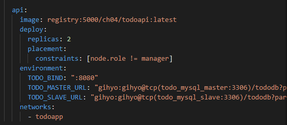

# Docker04

1. docker exec -it manager sh 에서

   docker service ls 하면 `todo_mysql_master` `todo_mysql_slave` 있음을 모두 확인할 수 있음

2. 교재 p.146 (마스터 서비스 실행)

   ```sql
   docker service ps todo_mysql_master --no-trunc --filter "desired-state=running" --form  at "docker exec -it {{.Node}} docker -it {{.Name}}.{{.ID}} bash"
   ```

   --no-trunc : 숨기는 것 없이 모두 실행

   ```sql
   docker exec -it [마스터커맨드] bash (위에 명령어 입력하고 나오는 내용 그대로 복붙하면 가능)
   ```

   `init-data` 데이터 들어있는지 확인 후 초기화

   ```sql
   root@ /# ls -al /usr/local/bin
   # init-data.sh
   # mysql -ugihyo -p tododb (데이터접속)
   
   mysql> show tables 표 확인
   ```

   

   

---

## 복습!

### 1. 네트워크 구성할 것 기획

: manager, worker01, worker02, worker03 컨테이너 구성

### 2. 폴더 다운

* swarm 폴더에 todo폴더와 stack폴더 docker-compose.yml 파일을 git으로 다운받기

* docker-compose.yml의 서비스는 5개의 컨테이너 내용으로 구성 

  : registry. manager. worker01, worker02, worker03

  : registry는 일반 서비스로 이미지 파일 업로드하는 저장소 용도

  나머지 4개는 host로 이용해 새로운 컨테이너 설치 가능

  : manager ports에서 `8000:80`이므로 외부에서 8000으로 요청이 들어오면 80으로 연결되고, `9000:9000`이면 외부에서 9000으로 요청이 들어오면 9000으로 응답. 이외의 요청에는 아무 행동도 할 수 없어 오류 발생


### 3. docker-compose

1. 기존에 시행하고 있던 모든 시스템을 정리하기 위해

   ```sql
   docker-composer down 또는 ctrl+c
   ```

   로 컴포즈 파일을 닫고

   ```sql
   docker system prune
   ```

   을 통해 모든 시스템 종료 (현재 중지되어 있는 모든 프로그램 정리)

2. `docker-compose.yml`시행해 registry, manager, worker 컨테이너 제작

   ```sql
   docker-compose up
   ```

   작동하면 `docker ps`에서 5가지 컨테이너 실행중이어야 한다(status가 up 이어야)

   ```sql
   PS C:\Users\HPE> docker ps
   CONTAINER ID        IMAGE                 COMMAND                  CREATED              STATUS              PORTS                                                                   NAMES
   
   09b2e4e21702        docker:19.03.5-dind   "dockerd-entrypoint.…"   59 seconds ago       Up 53 seconds       2375-2376/tcp, 4789/udp, 7946/tcp, 7946/udp                             worker01
   
   5d764cd361d1        docker:19.03.5-dind   "dockerd-entrypoint.…"   59 seconds ago       Up 53 seconds       2375-2376/tcp, 4789/udp, 7946/tcp, 7946/udp                             worker03
   
   c4d3f916e16c        docker:19.03.5-dind   "dockerd-entrypoint.…"   59 seconds ago       Up 54 seconds       2375-2376/tcp, 4789/udp, 7946/tcp, 7946/udp                             worker02
   
   73dcda4a877d        docker:19.03.5-dind   "dockerd-entrypoint.…"   About a minute ago   Up 58 seconds       2375-2376/tcp, 3375/tcp, 0.0.0.0:9000->9000/tcp, 0.0.0.0:8000->80/tcp   manager
   
   59c59a7febdd        registry:latest       "/entrypoint.sh /etc…"   About a minute ago   Up About a minute   0.0.0.0:5000->5000/tcp                                                  registry
   ```

   

### 4. SWARM 연결 : swarm init & join

: 다른 컨테이너 연결해 멀티호스트 작업을 하기 위해 시행

1) swarm연결작업은 매니저에서 시행 

docker 안에 host로 쓰일 애들인 registry를 제외한 4개를 같은 네트워크를 사용해 연결

```sql
docker exec -it manager sh
# hostname > 아이디 확인
# ifconfig 또는 #ip addr show 또는 # hostname -i 통해 ID address를 확인 
```

2)  SWARM 초기화 

```sql
docker exec -it manager docker swarm init

To add a worker to this swarm, run the following command:
    docker swarm join --token SWMTKN-1-3vc372f3sdikmu1stxy1153w2zkd01vc6qs62dontpuxs81ey7-d4kjufrg254dhmpq1rcz3glze 172.30.0.3:2377
```

아래 swarm을 추가하기 위해 나타난 `docker swarm join ~` 부분을 복사하기

3) Worker에 연결 (마우스 오른쪽버튼 통해 복사 붙여넣기 가능)

```sql
docker exec -it worker01 sh
#     docker swarm join --token SWMTKN-1-3vc372f3sdikmu1stxy1153w2zkd01vc6qs62dontpuxs81ey7-d4kjufrg254dhmpq1rcz3glze 172.30.0.3:2377
```

4) `docker node ls`(매니저로 접속해야)를 통해 join 되었음을 확인

hostname을 통해 manager, worker에 각각 연결되어 있음을 확인가능

```sql
PS C:\Users\HPE> docker exec -it manager docker node ls

ID                            HOSTNAME            STATUS              AVAILABILITY        MANAGER STATUS      ENGINE VERSION

zri4x9n5yo1ozzk1wqz8n6hbb     5d764cd361d1        Ready               Active                                  19.03.5

bfmyu95t162sdfe9kvydoodtp     09b2e4e21702        Ready               Active                                  19.03.5

qhsef7hfz23k71pk8y6zjflfh *   73dcda4a877d        Ready               Active              Leader              19.03.5

ljh7q5wawvuot9yzn1zq4mk5x     c4d3f916e16c        Ready               Active                                  19.03.5
```


### 5. Service 생성 : deploy 통해 visualizer 설치

> service : 1) compose : 컨테이너 생산 / 2) swarm : 컨테이너 목록 / 3) kubernetes
>
> 애플리케이션을 구성하는 일부 컨테이너를 제어하기 위한 단위

1) 서비스 확인

```sql
docker servie ls
docker service ps [컨테이너ID]
```

2) Stack의 확인

> Stack : 하나 이상의 서비스를 그룹으로 묶은 단위, 어플리케이션 전체 구성
>
> 여러 서비스를 함께 다룰 수 있어 스택을 사용해 배포된 서비스는 overlay그룹에 속함

```sql
docker stack ls
```

`docker-compose` 파일에 `volumes:` 에 `"./stack:stack"`으로 현재 디렉토리의 파일 4가지를 동일하게 확인 가능 

현재 디렉토리의 파일이 도커의 스택에 저장되어야 정보를 공유받을 수 있음


3) `visualizer.yml`로 크롬에서 `localhost:9000`입력시 컨테이너 시행 내역 확인

: 서비스 이름은 `app`이고, `9000:8080`으로 외부에서 9000으로 요청하는 경우에 8080으로 응답 (`8080`이 기본 port번호)


```sql
docker exec -it manager sh
# docker stack deploy -c /stack/visualizer.yml visualizer

Creating network visualizer_default
Creating service visualizer_app
```

4) stack이 잘 생성되었는지 확인

```sql
PS C:\Users\HPE> docker exec -it manager sh
/ # docker stack ls
NAME                SERVICES            ORCHESTRATOR
visualizer          1                   Swarm

/ # docker stack services visualizer
ID                  NAME                MODE                REPLICAS            IMAGE                             PORTS
1actnzaaq87n        visualizer_app      global              0/1                 dockersamples/visualizer:latest   *:9000->8080/tcp

/ # docker service ps visualizer_app
ID                  NAME                                       IMAGE                             NODE                DESIRED STATE       CURRENT STATE                ERROR               PORTS
qocj08bazkcn        visualizer_app.qhsef7hfz23k71pk8y6zjflfh   dockersamples/visualizer:latest   73dcda4a877d        Running             Running about a minute ago
```

5) visualizer이 시행되면 인터넷에 연결해 컨테이너 상황 확인 가능


6) 서비스의 ID확인

```sql
docker exec -it manager sh

/ # docker ps > visualizer의 ID확인
CONTAINER ID        IMAGE                             COMMAND             CREATED             STATUS                    PORTS               NAMES
ac67b2122825        dockersamples/visualizer:latest   "npm start"         21 minutes ago      Up 21 minutes (healthy)   8080/tcp            visualizer_app.qhsef7hfz23k71pk8y6zjflfh.qocj08bazkcn1br3daxxh39mv

/ # docker exec -it ac67b2122825 sh > ID통해 시행

/app # hostname -i > visualizer의 IP확인
10.0.1.3
```

7) port 연결확인

`docker ps`를 통해 확인한 visualizer의 PORTS는 `8080`이다.

`docker-composer`을 통해 `manager`이 `9000:9000`으로 연결하고, `visualizer.yml` 통해`app`이  `9000:8080`으로 연결되어` visualizer`의 `8080` 시행

### 6. Master/Slave(mysql) 이미지 생성 : build

1) 마스터/슬레이브 구조 구축위한 인증정보

- 

2) Mysql:5.7 이미지 다운

3) MySQL의 설정 파일 (고정값을 써도 되나, 하나의 파일로 마스터와 slave를 모두 설치해야 하므로 고정값보다는 함수와 파일을 이용해 설치) : `mysqld.conf` 파일

```sql
log-bin=var/log/ ...
```

> add-server-id.sh가 먼저 실행되어야 서버아이디가 동일해지지 않고 ip값이 나타남

4) `dockerfile`을 통해 mysql 실행 (모든 파일을 `CRLF`를 `LF`로 바꾸어 저장)


5) 아래와 같이 etc, sql 등의 파일이 있는 `tododb` 디렉토리에서 이미지를 빌드 (기존 이미지 있으면 삭제 필요)


```sql
C:\Users\HPE\work\docker\day03\swarm\todo\tododb> docker build -t localhost:5000/ch04/tododb:latest .
# 반드시 도커파일이 있는 디렉토리에서 이미지 필드 필요
# -t를 통해 tag를 통해 이름 지정
```

```sql
PS C:\Users\HPE\work\docker\day03\swarm\todo\tododb> docker images
#이미지 잘 빌드되었는지 확인
REPOSITORY                   TAG                 IMAGE ID            CREATED             SIZE
localhost:5000/ch04/tododb   latest              a4eefaaf5ffc        2 minutes ago       479MB
```


### 7. 이미지 등록 :  push

* 다른 worker들이 사용할 수 있도록 이미지 등록

  ```sql
  docker push localhost:5000/ch04/tododb:latest
  ```

  인터넷에 `localhost:5000/v2/_catalog`통해 이미지 등록되었는지 확인 가능

  

### 8. todo-mysql stack 추가 및 배포 : overlay & deploy

1) `todo-mysql.yml`에서 `networks`에 `todoapp`인지 확인


2) docker network 생성(overlay)

```
PS C:\Users\HPE\work\docker\day03\swarm\todo\tododb> docker exec -it manager sh

/ # docker network create --driver=overlay --attachable todoapp
kesgkhh4rag3fvcjue1g5i6sw

/ # docker network ls
NETWORK ID          NAME                 DRIVER              SCOPE
kesgkhh4rag3        todoapp              overlay             swarm
```

3) `todo`스택 형성 확인

```sql
/ # ls -al /stack

drwxrwxrwx    2 root     root             0 Jan  6 01:05 todo
```

4) stack 배포

```sql
/ # docker stack deploy -c /stack/todo-mysql.yml todo_mysql
Creating service todo_mysql_master
Creating service todo_mysql_slave
```

5) 서비스 시행 확인

```slq
/ # docker service ls

ID                  NAME                MODE                REPLICAS            IMAGE                              PORTS
mz0h9azn3082        todo_mysql_master   replicated          1/1                 registry:5000/ch04/tododb:latest
79dgo0xplqxw        todo_mysql_slave    replicated          2/2                 registry:5000/ch04/tododb:latest
1actnzaaq87n        visualizer_app      global              1/1                 dockersamples/visualizer:latest    *:9000->8080/tcp
```


### 9. MySQL 접속

```sql
PS C:\Users\HPE\work\docker\day03\swarm\todo\tododb> docker exec -it manager docker service ps todo_mysql_master --no-trunc --filter "desired-state=running" --format "docker exec -it {{.Node}} docker e
xec -it {{.Name}}.{{.ID}} bash"
를 입력하면 
docker exec -it 09b2e4e21702 docker exec -it todo_mysql_master.1.avan73xltrypbk6co1m7bfvjh bash
과 같이 나타난 것을 복사 붙여넣기 함
```

```sql
PS C:\Users\HPE\work\docker\day03\swarm\todo\tododb> docker exec -it 09b2e4e21702 docker exec -it todo_mysql_master.1.avan73xltrypbk6co1m7bfvjh bash

root@15ea566e638b:/# init-data.sh
# 파일을 통해 mysql 접속하도록 데이터 대입

mroot@15ea566e638b:/# mysql -ugihyo -p tododb
Enter password: (gihyo) # 비밀번호는 보안상 입력해도 보이지 않음! 비밀번호 오타없이 치고 엔터치면 MySQL접속

mysql> show tables; #mysql 접속되었음을 확인
+------------------+
| Tables_in_tododb |
+------------------+
| todo             |
+------------------+
1 row in set (0.00 sec)
```

### 11. Port 및 IP주소 확인

```sql
PS C:\Users\HPE> docker exec -it 09b2e4e21702 docker exec -it todo_mysql_master.1.avan73xltrypbk6co1m7bfvjh bash
# worker1의 컨테이너 ID가 09b2e4e21702로, 현재 master가 worker01에서 시행되고 있음

root@15ea566e638b:/# hostname -i (#IP address 확인)
10.0.2.3 

root@15ea566e638b:/# netstat -ntpl (port확인위한 커맨드 설치되어 있지 않음)
bash: netstat: command not found

root@15ea566e638b:/# apt-get install -y net-tools #포트보는 것 설치

root@15ea566e638b:/# netstat -ntpl # 포트확인
Active Internet connections (only servers)
Proto Recv-Q Send-Q Local Address           Foreign Address         State       PID/Program name
tcp        0      0 127.0.0.11:37827        0.0.0.0:*               LISTEN      -
tcp6       0      0 :::3306                 :::*                    LISTEN      -
```

또는

```sql
docker exec -it worker01 sh
#docker ps
# docker exec -it [컨테이너ID] bash
root@ :/ hostname -i
10.0.2.3 > 확인가능
```


---

## STACK 운영방식


클라이언트가 `fronted stock`의 `fornted_nginx`를 요청하면 그림의 화살표를 따라 지그재그로 연결되면서 서비스 시행

app의 app_api는 golang언어로 제작하는데 webserver의 파일 모으는 등의 기술을 이용할 수 없어 proxy 전에 app_nginx를 제작해 시행


---

## API 서비스 구축

* Todo 앱의 도메인 담당
  * 도메인 : 우리가 가진 업무의 규칙, 작업하고자 하는 바운더리
  * 앱 기능 가지고 있어야 될 기능. 데이터를 보관하는 용도
* GO 언어로 구현
  * Cmd/main.go 실행 : mysql에 접속에 필요한 환경변수 값 얻어오기
  * env.go : 환경변수 값을 받아오는 코드
  * db.go : mysql 접속 및 테이블 매칭
  * handler.go : todo  api의 요청처리 > todohandler
    * service get : 전체데이터를 주세요
    * service post
    * service put

* 교재 p.154

### 1. Dockerfile 제작

```dockerfile
FROM golang:1.10 #golang 언어 이용

WORKDIR / #작업디렉토리 지정
ENV GOPATH /go

COPY . /go/src/github.com/gihyodocker/todoapi
RUN go get github.com/go-sql-driver/mysql
RUN go get gopkg.in/gorp.v1
RUN cd /go/src/github.com/gihyodocker/todoapi && go build -o bin/todoapi cmd/main.go
RUN cd /go/src/github.com/gihyodocker/todoapi && cp bin/todoapi /usr/local/bin/

CMD ["todoapi"] #전체 어플리케이션 실행 위한 명령어

```

### 2. 이미지 빌드 및 업로드

1) 아래와 같이 `dockerfile`이 있는 디렉토리로 접근


2) 이미지빌드

```sql
C:\Users\HPE\work\docker\day03\swarm\todo\todoapi> docker build -t localhost:5000/ch04/todoapi:latest .
```

3) 이미지 확인

```sql
PS C:\Users\HPE\work\docker\day03\swarm\todo\todoapi> docker images

REPOSITORY                    TAG                 IMAGE ID            CREATED             SIZE
localhost:5000/ch04/todoapi   latest              ffb5d5378f80        34 seconds ago      781MB
localhost:5000/ch04/tododb    latest              a4eefaaf5ffc        3 hours ago         479MB
```

4) 이미지 업로드

```sql
 C:\Users\HPE\work\docker\day03\swarm\todo\todoapi> docker push localhost:5000/ch04/todoapi:latest
```

5) 이미지 업로드 확인 : 앞서와 다르게 "ch04/todoapi" 올라간 것 확인


> 이미지가 업로드 되었으므로 이제 swarm 통해 배포 가능

### 3. Swarm에서 todo-api실행

1) `todo-app.yml`파일에서 `nginx` 주석으로 닫기 (`ctrl`+ `/`)




#contraints: [node.role !=manager]이므로 매니저가 적당한 컨테이너에 api 배치

#todo_bind: 8080으로 export됨

#TODO_MASTER_URL : 이름과 아이디 서로 교환 가능 (10.0.2.3 = todo_mysql_master)

2) 현재상황 체크

```sql
PS C:\Users\HPE\work\docker\day03\swarm\todo\todoapi> docker exec -it manager sh

/ # docker network ls
NETWORK ID          NAME                 DRIVER              SCOPE
ccfc58be7454        bridge               bridge              local
70826008f8dc        docker_gwbridge      bridge              local
cb24fbf589f9        host                 host                local
nqf3mqtps0lk        ingress              overlay             swarm
fbf5e61c7f48        none                 null                local
kesgkhh4rag3        todoapp              overlay             swarm
qq441ojpqheq        visualizer_default   overlay             swarm

/ # docker stack ls
NAME                SERVICES            ORCHESTRATOR
todo_mysql          2                   Swarm
visualizer          1                   Swarm

/ # docker stack services todo_mysql
ID                  NAME                MODE                REPLICAS            IMAGE                              PORTS
79dgo0xplqxw        todo_mysql_slave    replicated          2/2                 registry:5000/ch04/tododb:latest
mz0h9azn3082        todo_mysql_master   replicated          1/1                 registry:5000/ch04/tododb:latest
```

3) `todo_app.yml` 배포

* todo_app.yml 내용확인

```sql
docker exec -it manager sh

/ # cat ./stack/todo-app.yml
version: "3"
services:
  nginx:
    image: registry:5000/ch04/nginx:latest
    deploy:
      replicas: 2
      placement:
        constraints: [node.role != manager]
    depends_on:
      - api
    environment:
      WORKER_PROCESSES: 2
      WORKER_CONNECTIONS: 1024
      KEEPALIVE_TIMEOUT: 65
      GZIP: "on"
      BACKEND_HOST: todo_app_api:8080
      BACKEND_MAX_FAILES: 3
      BACKEND_FAIL_TIMEOUT: 10s
      SERVER_PORT: 8000
      SERVER_NAME: todo_app_nginx
      LOG_STDOUT: "true"
    networks:
      - todoapp

  api:
    image: registry:5000/ch04/todoapi:latest
    deploy:
      replicas: 2
      placement:
        constraints: [node.role != manager]
    environment:
      TODO_BIND: ":8080"
      TODO_MASTER_URL: "gihyo:gihyo@tcp(todo_mysql_master:3306)/tododb?parseTime=true"
      TODO_SLAVE_URL: "gihyo:gihyo@tcp(todo_mysql_slave:3306)/tododb?parseTime=true"
    networks:
      - todoapp

networks:
  todoapp:
    external: true
```

* stack 배포

```sql
docker exec -it manager sh
/ # docker stack deploy -c /stack/todo-app.yml todo_app

Creating service todo_app_nginx
Creating service todo_app_api
```

* 배포확인

  ```sql
  PS C:\Users\HPE\work\docker\day03\swarm\todo\todoapi> docker exec -it manager sh
  / # docker service logs -f todo_app_api
  todo_app_api.2.jgdelu6zegag@5d764cd361d1    | 2020/01/06 05:39:34 Listen HTTP Server
  todo_app_api.1.z3kc19ci3gyl@c4d3f916e16c    | 2020/01/06 05:39:34 Listen HTTP Server
  ```

### 4.`todo-api` IP주소 및 PORT확인

```sql
PS C:\Users\HPE\work\docker\day03\swarm\todo\todoapi> docker exec -it manager docker service ps todo_app_api --no-trunc
--filter "desired-state=running" --format "docker exec -it {{.Node}} docker exec -it {{.Name}}.{{.ID}} bash"

docker exec -it c4d3f916e16c docker exec -it todo_app_api.1.z3kc19ci3gyls115e67cuq3rv bash

docker exec -it 5d764cd361d1 docker exec -it todo_app_api.2.jgdelu6zegagwr4drutsz6fw7 bash
```

docker exec -it manager docker service ps todo_app_nginx --no-trunc --filter "desired-state=running" --format "docker exec -it {{.Node}} docker exec -it {{.Name}}.{{.ID}} bash"

```sql
PS C:\Users\HPE\work\docker\day03\swarm\todo\todoapi> docker exec -it c4d3f916e16c docker exec -it todo_app_api.1.z3kc19
ci3gyls115e67cuq3rv bash

root@546f34e57a48:/# hostname -i
10.0.2.15 > 이게 컨테이너 IP

root@4765d28348c2:/# apt-get update > netstat가 안되는 경우 install부터 해보고 그래도 안되면 update 시행하고 install 시행
root@4765d28348c2:/# apt-get install -y net-tools
root@4765d28348c2:/# netstat -ntpl
Active Internet connections (only servers)
Proto Recv-Q Send-Q Local Address           Foreign Address         State       PID/Program name
tcp        0      0 127.0.0.11:41363        0.0.0.0:*               LISTEN      -
tcp6       0      0 :::8080                 :::*                    LISTEN      1/todoapi
```

### 5. 컨테이너 정보요청 (CURL)

####  XGET

```sql
PS C:\Users\HPE\work\docker\day03\swarm\todo\todoapi> docker exec -it worker02 sh
/ # docker ps
CONTAINER ID        IMAGE                               COMMAND                  CREATED             STATUS              PORTS                 NAMES
546f34e57a48        registry:5000/ch04/todoapi:latest   "todoapi"                24 minutes ago      Up 24 minutes                             todo_app_api.1.z3kc19ci3gyls115e67cuq3rv
1f979c00782b        registry:5000/ch04/tododb:latest    "prehook add-server-…"   3 hours ago         Up 3 hours          3306/tcp, 33060/tcp   todo_mysql_slave.1.3hwiigakd7ts5bvby0zsszx27

/ # docker exec -it 1f979c00782b bash
#mysql_slave.1에 접속

oot@fe32f2ae085c:/# curl -XGET http://todo_app_api:8080/
bash: curl: command not found > curl명령어가 없는 것으로 명렁어 다운 필요

root@1f979c00782b:/# apt-get install -y curl 
#명령어 설치 방법 : apt-get install -y [명령어]
#curl : 클라이언트가 컨테이너의 목록 달라는 명령어 (페이지에 접속됨)

root@fe32f2ae085c:/# curl -XGET http://todo_app_api:8080/
404 page not found < 404페이지는 페이지가 없다는 것으로 정확한 주소 필요

root@1f979c00782b:/# curl -XGET http://todo_app_api:8080/todo?stats=DONE
#Done상태의 정보 가져오기
[{"id":1,"title":"MySQL 도커 이미지 만들기","content":"MySQL 마스터와 슬레이브를 환경 변수로 설정할 수 있는 MySQL 이미지 생성","status":"DONE","created":"2020-01-06T03:02:13Z","updated":"2020-01-06T03:02:13Z"},{"id":2,"title":"MySQL 스택 만들기","content":"MySQL 마스터 및 슬레이브 서비스로 구성된 스택을 스웜 클러스터에 구축한다","status":"DONE","created":"2020-01-06T03:02:13Z","updated":"2020-01-06T03:02:13Z"}]

root@fe32f2ae085c:/# curl -XGET http://todo_app_api:8080/todo?status=progress #progress상태의 정보가져오기
[{"id":3,"title":"API구현하기","content":"Go 언어로 TODO를 확인, 수정할 수 있는 API 구현","status":"PROGRESS","created":"2020-01-06T03:02:13Z","updated":"2020-01-06T03:02:13Z"},{"id":4,"title":"Nginx 도커 이미지 만들 기","content":"HTTP 요청을 백엔드로 전달하는 Nginx 이미지 만들기","status":"PROGRESS","created":"2020-01-06T03:02:13Z","updated":"2020-01-06T03:02:13Z"},{"id":5,"title":"API 스택 구축하기","content":"스웜에 Nginx와 API로 구성된 스택을 구축","status":"PROGRESS","created":"2020-01-06T03:02:13Z","updated":"2020-01-06T03:02:13Z"},{"id":6,"title":"웹 앱 구현하기","content":"Nuxt.js를 통해 API와 연동되는 웹 애플리케이션 구현","status":"PROGRESS","created":"2020-01-06T03:02:13Z","updated":"2020-01-06T03:02:13Z"},{"id":7,"title":"웹 앱 스택 구축","content":"스웜에 Nginx와 웹 앱으로 구성되는 스택을 구축","status":"PROGRESS","created":"2020-01-06T03:02:13Z","updated":"2020-01-06T03:02:13Z"}] 

root@fe32f2ae085c:/# curl -XGET http://todo_app_api:8080/todo?status=todo
[{"id":8,"title":"인그레스 구축하기","content":"외부에서 스웜 클러스터에 접근하게 해주는 인그레스 구축","status":"TODO","created":"2020-01-06T03:02:13Z","updated":"2020-01-06T03:02:13Z"}]
# 요렇게 한글이 나오면 됨
```

 mysql 실행

```sql
docker ps
docker exec -it [컨테이너ID] bash
root@fe32f2ae085c:/# mysql -ugihyo -p tododb
Enter password:gihyo
```

(localhost로 접속하려면 그 포트가 연결된 컨테이너에서 실행하고, todo_app_api라는 이름으로 접속하려면 아무곳에나 가도 접속가능)

```mysql
Select * From todo; 하면 8개 나타남
mysql> select * from todo
    -> ;
+----+----------------------------------+-------------------------------------------------------------------------------------------------------+----------+---------------------+---------------------+
| id | title                            | content                                                                                               | status   | created             | updated             |
+----+----------------------------------+-------------------------------------------------------------------------------------------------------+----------+---------------------+---------------------+
|  1 | MySQL 도커 이미지 만들기         | MySQL 마스터와 슬레이브를 환경 변수로 설정할 수 있는 MySQL 이미지 생성                                | DONE     | 2020-01-06 03:02:13 | 2020-01-06 03:02:13 |
|  2 | MySQL 스택 만들기                | MySQL 마스터 및 슬레이브 서비스로 구성된 스택을 스웜 클러스터에 구축한다                              | DONE     | 2020-01-06 03:02:13 | 2020-01-06 03:02:13 |
|  3 | API구현하기                      | Go 언어로 TODO를 확인, 수정할 수 있는 API 구현                                                        | PROGRESS | 2020-01-06 03:02:13 | 2020-01-06 03:02:13 |
|  4 | Nginx 도커 이미지 만들기         | HTTP 요청을 백엔드로 전달하는 Nginx 이미지 만들기                                                     | PROGRESS | 2020-01-06 03:02:13 | 2020-01-06 03:02:13 |
|  5 | API 스택 구축하기                | 스웜에 Nginx와 API로 구성된 스택을 구축                                                               | PROGRESS | 2020-01-06 03:02:13 | 2020-01-06 03:02:13 |
|  6 | 웹 앱 구현하기                   | Nuxt.js를 통해 API와 연동되는 웹 애플리케이션 구현                                                    | PROGRESS | 2020-01-06 03:02:13 | 2020-01-06 03:02:13 |
|  7 | 웹 앱 스택 구축                  | 스웜에 Nginx와 웹 앱으로 구성되는 스택을 구축                                                         | PROGRESS | 2020-01-06 03:02:13 | 2020-01-06 03:02:13 |
|  8 | 인그레스 구축하기                | 외부에서 스웜 클러스터에 접근하게 해주는 인그레스 구축                                                | TODO     | 2020-01-06 03:02:13 | 2020-01-06 03:02:13 |
+----+----------------------------------+-------------------------------------------------------------------------------------------------------+----------+---------------------+---------------------+
8 rows in set (0.00 sec)
```


#### XPOST

* 데이터 추가 : 9번 새로 생김

```sql
c:\Users\HPE\work\docker\day03\swarm\todo\todoapi> docker exec -it worker03 sh

/ # docker ps
CONTAINER ID        IMAGE                               COMMAND                  CREATED             STATUS              PORTS                 NAMES
4765d28348c2        registry:5000/ch04/todoapi:latest   "todoapi"                About an hour ago   Up About an hour                          todo_app_api.2.jgdelu6zegagwr4drutsz6fw7
fe32f2ae085c        registry:5000/ch04/tododb:latest    "prehook add-server-…"   4 hours ago         Up 4 hours          3306/tcp, 33060/tcp   todo_mysql_slave.2.kjg3jdyubazmcow9vokhafat0

/ # docker exec -it fe32f2ae085c bash

root@fe32f2ae085c:/#curl -XPOST -d '{"title":"Test9", "content":"Content9"}' http://todo_app_api:8080/todo
```

todo로 데이터 입력되어 TODO상태 curl하면 9번이 추가되어 2개 나타남 > mysql 접속해 확인

```sql
root@fe32f2ae085c:/# mysql -ugihyo -p tododb
Enter password:

mysql> select * from todo;
+----+----------------------------------+------------------------------------------------
|  9 | Test9                            | Content9                                                                                              | TODO     | 2020-01-06 06:50:48 | 2020-01-06 06:50:48 |

9 rows in set (0.00 sec)
```


#### XPUT

* 업데이트 쿼리 : 9번 title, content, status 변한 것 확인 가능

  ```sql
  curl -XPUT -d '{"id":9, "title":"Modified title", "content":"Modified Content", "status":"Done"}' http://todo_app_api:8080/todo
  
  root@fe32f2ae085c:/# mysql -ugihyo -p tododb
  Enter password:
  
  mysql> select * from todo;
  +----+----------------------------------+---------------------------------------------
  |  9 | Modified title                   | Modified Content                                                                                      | DONE     | 2020-01-06 06:50:48 | 2020-01-06 07:04:10 |
  9 rows in set (0.00 sec)
  
  ```


---

## APP_nginx 거쳐 API 서비스에 접근하기

> 클라이언트 요청 > Nginx reverse proxy : 8000 > Backend web application(API서비스) : 8080
>
> 장점 : 접근 로그 생성(단일접근), 캐시 제어, 라우팅 설정


* Entrykit 템플릿을 이용하여 환경변수 제어

* {{var "환경변수명"}}

  {{var "환경변수명" | default "변수값"}}


### 1. Dockerfile 제작

* Dockerfile 제작 : from nginx:1.13

  

  * render 통해 tmpl 파일이 전환됨

* `todo-app.yml`의 주석제거


서버이름은 `todo_app_nginx`로 설정되고, PORT는 `8000` / backend_host는 `todo_app_api:8080`으로 클라이언트 8000 요청을 8080으로 연결

### 2. 이미지빌드 및 업로드

```sql
C:\Users\HPE\work\docker\day03\swarm\todo\todonginx> docker image build -t localhost:5000/ch04/todo_nginx:latest .
```

```sql
docker push localhost:5000/ch04/nginx #이미지이름 바꾸지 않도록 주의하기
```


### 3. swarm에서 todo_nginx시행

* stack 배포

```sql
docker exec -it manager sh
/ # docker stack deploy -c /stack/todo-app.yml todo_app

Updating service todo_app_nginx
Updating service todo_app_api
```

```sql
/ # docker stack services todo_app
ID                  NAME                MODE                REPLICAS            IMAGE                               PORTS
8t0vyyw0k659        todo_app_nginx      replicated          2/2                 registry:5000/ch04/nginx:latest
neiiy10o7qzt        todo_app_api        replicated          2/2                 registry:5000/ch04/todoapi:latest
```

1. 


### 4. IP 및 PORT 확인하기

```sql
docker exec -it manager docker service ps todo_app_nginx --no-trunc --filter "desired-state=running" --format "docker exec -it {{.Node}} do
cker exec -it {{.Name}}.{{.ID}} bash"

docker exec -it 09b2e4e21702 docker exec -it todo_app_nginx.1.nbenh8u0a8dcgsusnvgv14dwy bash

docker exec -it c4d3f916e16c docker exec -it todo_app_nginx.2.c4m1ps1do9dh2b8ec5dfgo6i3 bash

PS C:\Users\HPE\work\docker\day03\swarm\todo\todonginx> docker exec -it 09b2e4e21702 docker exec -it todo_app_nginx.1.nbenh8u0a8dcgsusnvgv14dwy bash

root@e4394c5c3ec8:/# hostname -i
10.0.2.223

root@e4394c5c3ec8:/# apt-get install -y net-tools
root@e4394c5c3ec8:/# netstat -ntpl
tcp        0      0 0.0.0.0:8000            0.0.0.0:*               
```

### 5. CURL 통해 정보요청

```sql
C:\Users\HPE\work\docker\day03\swarm\todo\todonginx> docker exec -it worker02 

/ # docker ps
registry:5000/ch04/nginx:latest     "render /etc/nginx/n…"   11 minutes ago      Up 11 minutes       80/tcp                todo_app_nginx.2.c4m1ps1do9dh2b8ec5dfgo6i3


/ # docker exec -it 951b71eadb32 bash

root@951b71eadb32:/# apt-get install -y curl
root@951b71eadb32:/# curl -XGET http://todo_app_nginx:8000/todo?status=DONE
[{"id":9,"title":"Modified title","content":"Modified Content","status":"DONE","created":"2020-01-06T06:50:48Z","updated":"2020-01-06T07:04:10Z"},{"id":1,"title":"MySQL 도커 이미지 만들기","content":"MySQL 마스터와 슬레이브를 환경 변수로 설정할 수 있는 MySQL 이미지 생성","status":"DONE","created":"2020-01-06T03:02:13Z","updated":"2020-01-06T03:02:13Z"},{"id":2,"title":"MySQL 스택 만들기","content":"MySQL 마스터 및 슬레이브 서비스로 구성된 스택을 스웜 클러스터에 구축한다","status":"DONE","created":"2020-01-06T03:02:13Z","updated":"2020-01-06T03:02:13Z"}]
```


### 6. 결론) api:8080 / nignx:8000 동일한 결과로 나타나야

```sql
root@1f979c00782b:/# curl -XGET http://todo_app_api:8080/todo?stats=DONE
root@1f979c00782b:/# curl -XGET http://todo_app_nignx:8000/todo?stats=DONE
```

****


----

## WEB SERVICE 구축

> Nginx proxy : 정적파일은 nginx에서 바로 응답해 빠르게 처리 가능


### 1. NPM(의존성 모듈) 설치

```sql
PS C:\Users\HPE\work\docker\day03\swarm\todo\todoweb> dir


    디렉터리: C:\Users\HPE\work\docker\day03\swarm\todo\todoweb


Mode                LastWriteTime         Length Name
----                -------------         ------ ----
d-----     2020-01-06   오후 1:58                assets
d-----     2020-01-06   오후 1:58                layouts
d-----     2020-01-06   오후 1:58                middleware
d-----     2020-01-06   오후 1:58                pages
d-----     2020-01-06   오후 1:58                plugins
d-----     2020-01-06   오후 1:58                static
d-----     2020-01-06   오후 1:58                store
-a----     2020-01-06   오후 1:57            192 Dockerfile
-a----     2020-01-06   오후 1:57           1206 nuxt.config.js
-a----     2020-01-06   오후 1:57         393259 package-lock.json
-a----     2020-01-06   오후 1:57            944 package.json
-a----     2020-01-06   오후 1:57           1152 server.js


PS C:\Users\HPE\work\docker\day03\swarm\todo\todoweb> npm install
```


### 2. Dockerfile 제작


npm을 설치하고, 이미지 제작


### 3. 이미지 제작 및 업로드

```sql
docker build -t 

docker image push localhost:5000/ch04/
```


### 4. Nginx를 통한 통합 접근

### 5. Ingress를 사용해 TODO 웹 애플리케이션을 외부로 공개

```sql
docker exec -it manager sh
docker stack deploy -c /stack/todo-ingress.yml todo_ingress
```

### 6. 컨테이너 배치 구조 및 실행화면


----

# KUBERNETES

* Docker container 운영을 자동화하기 위한 컨테이너 오케스트레이션 툴

  * 컨테이너 배포 및 배치 전략
  * Scale in/Scale out
  * Service discovery
  * 기타운용

* 구글의 Borg 프로젝트에서 시작

* 2017년 docker에 정식으로 통합된 사실상 표준 (DockerCon EU 2017)

  But Docker을 설치했을 때 기본으로 설치되는 것은 Swarm. kubernetes는 별도로 다운 필요 >  쿠버네티스는 사용법은 복잡하나 기능이 다양 (Cli 명령어)

* `todo`라고 현재 진행하는 간단한 웹페이지도 컨테이너가 10개 넘게 필요한데 , 아마존 같은 복잡한 웹사이트의 경우에는 수백개를 넘어 수천개 필요


## 쿠버네티스 설치

* 작업관리자의 도커 아이콘을 오른쪽 클릭해 `setting`의  `kubernetes`에서 모두 체크한 후 install

* Kubectl 설치 [큐브컨트롤](http://storage.googleapis.com/kubernetes-release/release/v1.17.0/bin/windows/amd64/kubectl.exe)

  > 작업할 폴더인 `docker`로 kubetl.exe파일을 이동해 path설정해 파일 설치

```sql
C:\Users\HPE\Work>cd docker
C:\Users\HPE\Work\docker>dir

C:\Users\HPE\Work\docker>kubectl version

Client Version: version.Info{Major:"1", Minor:"17", GitVersion:"v1.17.0", GitCommit:"70132b0f130acc0bed193d9ba59dd186f0e634cf", GitTreeState:"clean", BuildDate:"2019-12-07T21:20:10Z", GoVersion:"go1.13.4", Compiler:"gc", Platform:"windows/amd64"}

Server Version: version.Info{Major:"1", Minor:"14", GitVersion:"v1.14.8", GitCommit:"211047e9a1922595eaa3a1127ed365e9299a6c23", GitTreeState:"clean", BuildDate:"2019-10-15T12:02:12Z", GoVersion:"go1.12.10", Compiler:"gc", Platform:"linux/amd64"}
#이렇게 클라이언트와 서버 버전 각각 나오면 설치 완료
```

* 대시보드 설치 : 쿠버네티스에 배포된 컨테이너 등에 대한 정보를 한눈에 볼 수 있는 프로그램 > 잘못하면 비밀번호 등이 공개되므로 되도록 개발상태에서만 이용

```sql
C:\Users\HPE>kubectl apply -f https://raw.githubusercontent.com/kubernetes/dashboard/v1.8.3/src/deploy/recommended/kubernetes-dashboard.yaml
secret/kubernetes-dashboard-certs created
serviceaccount/kubernetes-dashboard created
role.rbac.authorization.k8s.io/kubernetes-dashboard-minimal created
rolebinding.rbac.authorization.k8s.io/kubernetes-dashboard-minimal created
deployment.apps/kubernetes-dashboard created
service/kubernetes-dashboard created
```

```sql
C:\Users\HPE>kubectl get pod --namespace=kube-system -l k8s-app=kubernetes-dashboard
NAME                                    READY   STATUS    RESTARTS   AGE
kubernetes-dashboard-6fd7f9c494-gff5n   1/1     Running   0          47s
```

> status 상태가 `running`이어야 한다.

 ```sql
C:\Users\HPE>kubectl proxy
Starting to serve on 127.0.0.1:8001
 ```

[대시보드설치](http://localhost:8001/api/v1/namespaces/kube-system/services/https:kubernetes-dashboard:/proxy/)

> tocken 선택하지 않고 설치


