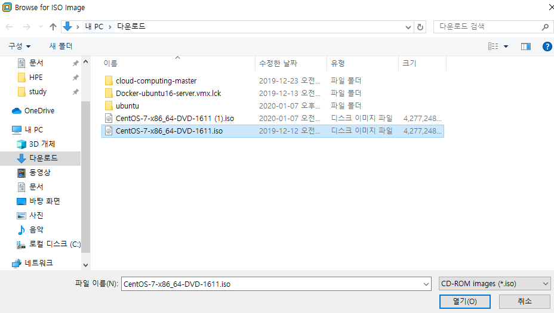
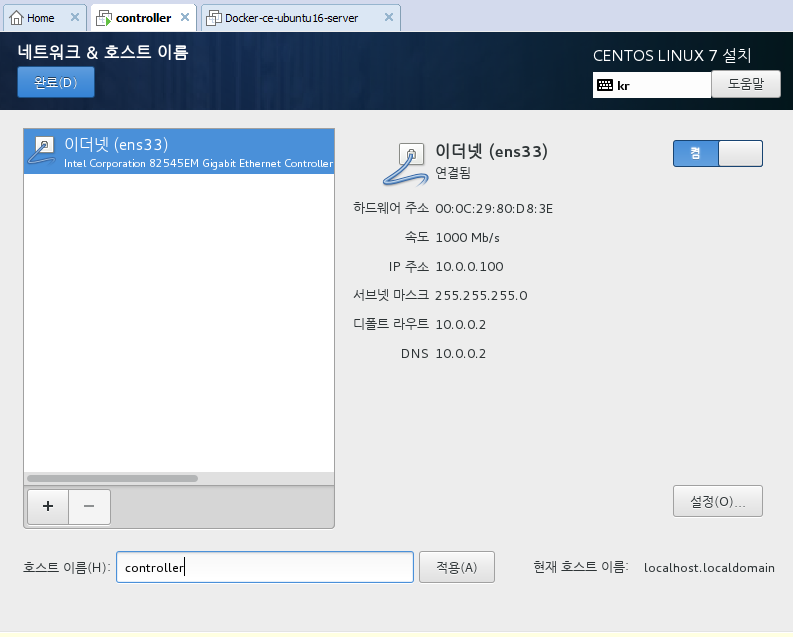

20.01.07

# 오픈스택 01

인터넷으로 `59.29.224.11` 접속 (Berryz Webshare)해 

## 오픈스택의 개념

* 퍼블릭이 좋긴 하지만, 돈이 많이 들어 로컬로 유지하고자 하는 상황 발생 > 오픈스택이 유사한 환경을 로컬에 구사하는 기술 

  > 무료로 비용절감의 장점 but 버그는 사용자 책임

* [NHN TOAST](toast.com/kr) : 오픈스택 통해 프라이빗 서비스 제공 ;  대시보드 등 가상 서비스

* CentOS : Packstack / Ubuntu : DevStack

* 클라우드서비스의 POINT는 '자동화'

* CLI는 스크립팅 기능 제공. 리눅스에서 셀 기반으로 작업한 것을 파일로 작성 후 자동화 가능 / 반면 대시보드는 interactive한 방식

*  Public / Private Cloud는 '누가' 사용하는지에 Data 저장소 위치가 달라진다

  * Public Cloud : Any / 저장소는 provider에 존재 (덜 민감한 데이터)

  * Private Cloud : 제한적 사용자(ex. 사원) / 기업의 데이터 센터 안, 즉 로컬에 저장 (비교적 민감한 데이터)

  * Hybrid Cloud : Public + Private Cloud

  * Public cloud로 사용하면 비용이 계속 발생하므로, 안정화되면 private cloud로 바꾸는게 좋음 

    > Saas, Paas로 서비스를 제공하다가 Private나 Hybrid로 바꾸는 과정에서 사용하는 것이 오픈스택

* 클라우드 서비스 모델 : Saas / Paas / Iaas

  * IaaS 제공자가 SaaS나 Paas의 제공자가 될 수 있고, SaaS제공자가 Paas제공자가 될수 있다. 
  * 클라우드 서비스 vs 클라우드 서비스 모델 구별해 각각 설명할 수 있어야 한다.
  * Infra는 C언어 등 / Software은 객체지향언어, java언어


* 2006 AWS 시작 : EC2 / S3 / SQS (Q : 정보를 요청받아 제공)

  * 과거에는 솔루션을 쥐고 closed 한 서비스를 제공했다면, 최근에는 open소스를 제공해 사용자들을 늘리는 형태로 가고 있음 

    -> 많은 사용자들을 확보해 서비스를 판매하거나 더 큰 기업에 인수하는 형식으로 활용

* 오픈스택은 2010년부터 시작한 후발주자로, 선발주자의 문제를 보완해 산업표준화 (NASA와 Rackspace가 하던 프로젝트를 오픈소스화 함)

  * 2010.10.21 Austin으로 시작해 ABC 등 알파벳 순으로 진행되어 가장 2019.10월 Train이 가장 최근 버전
  * 하지만 가장 최근버전은 아직 불안정해 전전버전을 가장 추천함 (Rocky)

* 이제는 돈을 내고 서버를 구축하는 시대가 아니라, 일정 용량을 과금을 내고 서버를 이용할 수 있는 세대이다.

---

P.48

## 오픈스택 릴리즈

* [릴리즈노트](wiki.openstack.org/wiki/ReleaseNotes/Juno/ko) ; 시리즈명 바꾸면서 다운 가능 (Mitaka까지)

  [오픈스택](docks.openstac.org) (Newton 이후)

* Route53 : 고가형성 100%로 신뢰성 높음

  AWS에서 제공하는 DNS(도메인 네임 시스템)

---

p.51

## 오픈스택서비스

* Swift : Object Storage_ ex 클라우드에 내 사진 등 자동 저장됨
* Horizon : Dashboard_다양한 서비스들이 메뉴로 제공되어 클릭으로 서비스 선택
* Keystone : Identity_클라우드 서비스들이 보안에 취약하므로 인증절차 필요

---

## 오픈스택 소개

* Identity Service Keystone(Cont.)

  * 사용자 및 API에 대한 인증 및 권한 서비스 제공
  * 사용자 인증을 통해 물리 서버 내의 자원을 사용 가능
  * OpenStack 서비스들을 통합하기 위한 통합인증시스템
  * 인증토큰 매커니즘
    * 오픈스택 클라이언트는 다양한 컴포넌트들에 많은 API 호출을 하기 때문에 이러한 호출에 대해 ID/비밀버호를 이요한 인증은 보안 및 성능면에서 좋지 않음
    * 클라이언트는 API 호출 전 토큰을 획득하고 사요한 컴포넌트에 토큰 ID 보냄
    * 클라이언트는 Keystone서버에 토큰을 획득해 서비스에 토큰을 보내고, 서비스는 ID 확인을 요청하고 인증이 된다면 서비스를 제공

* Cloud Image Service Glance

  * 다양한 하이퍼바이저에서 사용할 수 있는 가상 머신 이미지를 관리하고 가상머신에 설치된 운영체제를 보관 및 관리

* NOVA : Cloud compute service

  * 가상머신 라이프사이클 관리자 > 사용자 요청따라 컴퓨팅 자원 제공하고 관리

  * 가상머신의 생성, 갱신, 삭제 등 생명주기 관리

  * 대규모의 가상 컴퓨트 인스턴스들을 자동적으로 제어하고 운영하기 위한 오픈소스

  * 클라우드 인프라 서비스의 핵심 서비스 

  * NOVA가 지원하는 하이퍼 바이저(가상체제)

    * Qemu와 KVM[Kernel Based Virtual Machine_CPU 가상모드가 지원되는 시스템, 하드웨어 의존] (리눅스) - 무료. A군(옛날)

    * Hyper-V(윈도우), Vmware, XenServer6.2 - 유료. B군(최근 더 좋음)

    * Baremetal : 가상머신을 사용하고 싶지 않아 하드웨어에 물리적 시스템을 instance로 제공

    * docker, Xen via libvirt, LXC via libvirt[리눅스컨테이너] : 하이퍼 바이저 기반의 가상머신은 무겁게 올라가기 때문에 가볍게 컨테이너 기반의 시스템 제공

    * 하이퍼 바이저가 가상체제에서 시행되면서 cpu 메모리 할당으로 오버로드 걸리는 경우가 많음. 따라서 가상화를 지원하지 않으면 Qemu사용하는 것이 필요하고, 가상머신을 지원하면 Hyper-V 사용

      Hyper-V가 유료이고 최신버전이라 더 좋음에도 불구하고 가상머신이 필요해 가상모드를 지원하지 않는 경우에는 Qemu 사용해야

---

* Storge 유형 (유형별로 클라이언트의 접근방식이 달라진다)

  * block기반 스토리지 : Cinder, EBS, iscsi, SAN \

    > 장치파일 형태로 접근

  * Object 기반 스토리지 : swift, S3, Ceph 

    > Http기반. 웹에 파일을 올려 공유 (ex. 구글드라이브)_업로드 하는 파일을 object라고 하는데, 파일의 바운더리가 업로드된 것을 resource라고 한다.
    >
    > RESTful API : GET, PUT, POST, DELETE
    >
    > CRUD[Create, Read, Update, Delete]
    >
    > Enduser가 사용하기에 가장 편리해 많이 이용

  * File 기반 스토리지 : Manila, EFS, glusterfs

    > 특정 디렉토리와 연결하여 사용: mount

  * Database 기반 스토리지 : Trove, Dynamodb, RDS(관계형DB)

    > 

* Mysql의 오픈소스 버전 : 마리아DB

* Object기반 스토리지는 주로 end-user가 많이 이용

  block, file, datatbase 기반 스토리지는 가상머신 등 클라우드 서비스에서 많이 이용

---

## 설치(p.60) 

### 자동화 툴을 이용한 설치

* IDC 센터처럼 많은 서버에 설치할 경우

* 오픈소스 기반 Chef, Puppet을 많이 사용함 

* http://docs.opscode.com/openstack.html

  https://forge.puppetlabs.com/puppetlabs/openstack

* Redhat Solutions : 소규모 10~15대_Packstack / 대규모__Foreman, openstack platform director _ puppet. 20분

  Canonical Solutions : juju. maas, charms _ charms 허브에서 이미지를 다운받아 juju 통해 쉽게 배포 가능

  Mirantis solutions : fuel _ 그래픽도구 (openstack을 HA고가용성 아키텍쳐로 설치 가능. ceph 스토리지 사용. 상용 및 무료버전 모두 존재)

  Ubuntu : devstack, openstack installer _ shell방식. 40분

  openstack-ansible (lxc+ansible)

  kolla (lxn+ansible)

  openstack-helm (sopenstack on k8s) _ 한꺼번에 배포

### Devstack 방식 

* 오류가 발생하는 경우에는 앞에 모든 자료를 리셋하고 다시 설치해야 한다

### Packstack으로 All-in-One

> 오류 발생한 경우, 리셋할 필요없이 다시 설치하면 가능 : 이미 설치된 내용은 패스하면서 진행되기 때문에 빠르다
>
> 여러 대를 연결해 설치하는 경우에도 하나의 컴퓨터에만 다운해 다른 컴퓨터로 push해 멀티노드로 구축가능

* 메모리 16기가인지 확인

#### 0. Docker와의 충돌

Docker이 hyper-v 사용해 openstack과 충돌 발생할 수 있음

프로그램 및 기능에서 hyper-v 끄기


#### 1. VMWare Workstation 생성

1) Create > Custom > Custom > Linux에서 CentOS 64-bit > 이름 : `controller` / 저장경로 : `c:/openstack/controller` > processors : 1 / cores : 2 >  메모리 6GB > Network : NAT(공인IP로 바꿔주는 역할) > 100GB / single file (체크하면 진짜 100GB 할당. 체크하지 않으면 가상머신은 100GB로 인식하나 실제로는 사용량에 따라 달라짐)


2) `process` 클릭 : `VT -x/EPT or AMD-v/RVI` 지원하도록 활성화 (시스템에서 지원해야 가상머신에서도 지원 가능) _ KVM 지원


3) `CD/DVD`클릭 : CENTOS-7.ISO 연결




#### 2. Linux7 설치

1) 파티션 설정

2) 네트워크 설정

* NAT는 10.0.0.100 으로 설정
* ens33의 IPv4 설정 변경하고, 이름은 controller로 설정




3) 암호 : abc123

4) 설치완료 > 재부팅


#### 3. OS 전체 업데이트 (kernel 업데이트 > 리부팅 필요)

```sql
controller id : root
password : abc123 (보안문제로 보이지 않음)

controller] # ym update -y
```


#### 4. CentOS 서비스 최적화

>  Openstack과 상충되는 서비스 제거

* Xshell통해 입력

  연결


​		사용자인증


​	초록 불이 들어와야 연결된 것!

​	연결이 안된 경우에는 다른 가상머신에서 `10.0.0.`0을 사용하고있어서 일 수 있음. 이런 경우에는 다른 가상머신을 지우고 삭제후 다시 설치


* 방화벽 정지 및 비활성화

```sql
#systemctl stop firewalld > 지금 즉시 정지
#systemctl disable firewalld > 재부팅하더라도 비활성화된 상태로
```

* 네트워크매니저 (모바일 최적화) 

: 장소에 따라 profile을 inteface에 맞게 지원해주는 시스템 > 용도별 최적화 적용 지원 

ex. 새로 네트워크 연결시, 공공장소니? 라고 묻는 것

-> 모바일 서비스이므로, 데스크탑에서는 오히려 네트워크가 불안정하게 만듬

```sql
#systemctl disable NetworkManager
#systemctl stop NetworkManager
```

#### 5. NTP 서버구성

```sql
# yum -y install chrony
```

#### 6. Host에 등록

호스트에 정보를 등록해야 설치 가능

```sql
# vi /etc/hosts
```

폴더를 연 후에 `o`(open)를 눌러 

```sql
10.0.0.100 controller
10.0.0.101 compute1	
```

작성 후 `esc`눌러 나가고 `:wq!`해서 저장 및 나가기

#### 7. Openstack repository 등록

```sql
# yum repolist 통해 목록확인 (3개 등록되어 있음) 
# yum install -y centos -release-openstack-rocky #로키버전으로 열기
# yum repolist 통해 목록확인
# yum upgrade -y
```

#### 8. Centos 이미지 복사

compute1에도 지금까지 한 것과 동일한 작업이 필요해 이미지 복사 필요

/openstack/controller의 `controller.vmdk`를 /openstack과 /openstack/compute1 폴더에 각각 복사

/openstack/compute1 폴더의 이름은 `compute1.vmdk`로 바꾸기


